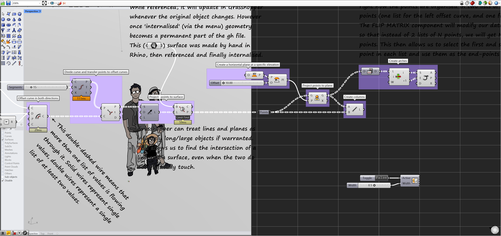

# CanvasTransparent

> Module: Grasshopper Components / Util

[← Back to command index](/en/commands/)

**Function**: Adjust the transparency of the Grasshopper canvas background.

*CanvasTransparent sets the Grasshopper canvas background to be transparent so that the model in the rear Rhino viewport is directly visible, making it easier to compare Rhino geometry in real time when editing components in GH*

> Screenshots and videos may show a Chinese-language interface. Labels and control positions can vary by Rhino or RSTool version.

**Usage**:

1. In the Grasshopper canvas, find the component from the "Util" group of the RsTool tag and drag it in
2. Connect each input port according to the parameter table (the ports marked "optional" are empty ports)
3. Executed once each time the canvas is solved, reading the results from the output port

**Parameters**:

| Display name | Parameter | Type | Default | Range | Description |
| --- | --- | --- | --- | --- | --- |
| Whether to activate background transparency display | Active | Boolean | No | single value |  |
| Transparent area width percentage | Width | numerical value | 0.4 | single value |  |

**Notes**: This component runs in the Grasshopper canvas, with inputs and outputs connected through component ports; it is executed once each time the canvas is solved.

Belongs to GH group: RsTool / Util
