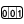

# Counter

> Module: Grasshopper Components / Animation

[← Back to command index](/en/commands/)

**Function**: Generate count values during a Grasshopper solve or animation.

**Usage**:

1. In the Grasshopper canvas, find the component from the "Animation" group of the RsTool tab and drag it in
2. Connect each input port according to the parameter table (the ports marked "optional" are empty ports)
3. Executed once each time the canvas is solved, reading the results from the output port

**Parameters**:

| Display name | Parameter | Type | Default | Range | Description |
| --- | --- | --- | --- | --- | --- |
| Start counter | On | Boolean | No | single value |  |

**Notes**: This component runs in the Grasshopper canvas, with inputs and outputs connected through component ports; it is executed once each time the canvas is solved.

Output parameters:
| Name | Type | Description |
| --- | --- | --- |
| Num | Integer | Counter number |

Belongs to GH group: RsTool / Animation
