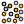

# RhinoRandomSelect

> Module: Grasshopper Components / Util

[← Back to command index](/en/commands/)

**Function**: Randomly selects Rhino document objects according to a specified proportion.

**Usage**:

1. In the Grasshopper canvas, find the component from the "Util" group of the RsTool tag and drag it in
2. Connect each input port according to the parameter table (the ports marked "optional" are empty ports)
3. Executed once each time the canvas is solved, reading the results from the output port

**Parameters**:

| Display name | Parameter | Type | Default | Range | Description |
| --- | --- | --- | --- | --- | --- |
| Whether to turn on | On | Boolean | No | single value |  |
| Percentage to deselect objects | Percent | numerical value | 50 | single value |  |

**Notes**: This component runs in the Grasshopper canvas, with inputs and outputs connected through component ports; it is executed once each time the canvas is solved.

Belongs to GH group: RsTool / Util
