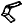

# ZigzagRamp

> Module: Grasshopper Components / Architecture

[← Back to command index](/en/commands/)

**Function**: Create a switchback ramp from multiple straight or polyline paths.

**Usage**:

1. In the Grasshopper canvas, find the component under the "Architecture" group of the RsTool tab and drag it in
2. Connect each input port according to the parameter table (the ports marked "optional" are empty ports)
3. Executed once each time the canvas is solved, reading the results from the output port

**Parameters**:

| Display name | Parameter | Type | Default | Range | Description |
| --- | --- | --- | --- | --- | --- |
| Polyline | Polyline | Curve |  | single value |  |
| RampWidth | RampWidth | numerical value | 2.0 | single value |  |
| RailHeight | RailHeight | numerical value | 1.1 | single value |  |

**Notes**: This component runs in the Grasshopper canvas, with inputs and outputs connected through component ports; it is executed once each time the canvas is solved.

Output parameters:
| Name | Type | Description |
| --- | --- | --- |
| Ramp | Polysurface | Ramp |
| Rail | Polysurface | Rail |

Belongs to GH group: RsTool / Architecture
