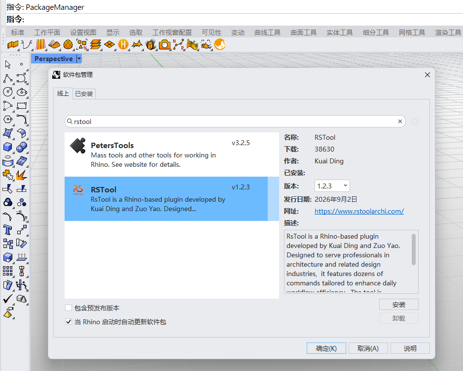
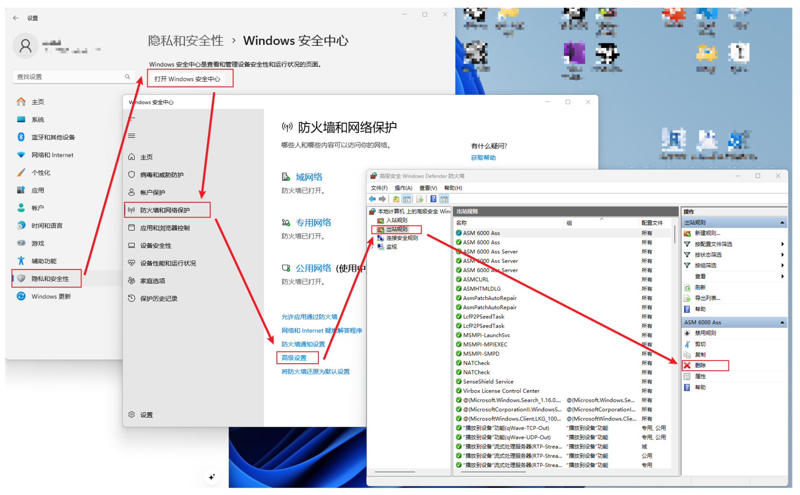

# RSTool Installation Guide

RSTool can be installed directly through Rhino's built-in package manager.

## Install with PackageManager

1. Open Rhino, enter `PackageManager` on the command line, and press Enter.
2. Search for `rstool` on the **Online** tab of the Package Manager.
3. Select **RSTool**, choose the version you want, and click **Install**. Save your work and restart Rhino if prompted.

## If RSTool does not appear in search

First confirm that Rhino can access the internet and that Package Manager is on the **Online** tab. If no result appears, check whether a Windows Firewall outbound rule is blocking Rhino:

1. Open **Settings → Privacy & security → Windows Security → Firewall & network protection → Advanced settings**.
2. Select **Outbound Rules** in Windows Defender Firewall with Advanced Security.
3. Look for a rule whose name contains Rhino and whose action is explicitly **Block the connection**. Record or export the rule first, then disable or remove only that blocking rule and search again in `PackageManager`.

::: warning Network and licensing

- Change only rules that explicitly block Rhino; do not disable Windows Firewall as a whole.
- Firewall and proxy settings may affect both package downloads and Rhino license validation. Record the original settings so you can restore them if necessary.
- If you use a proxy or VPN, add Rhino and McNeel website, licensing, and package-service domains to your proxy tool's **direct-connect or exclusion list** so they do not use the proxy. Do not block licensing servers. See [this Zhihu article](https://zhuanlan.zhihu.com/p/595993046) for a configuration example.

:::
