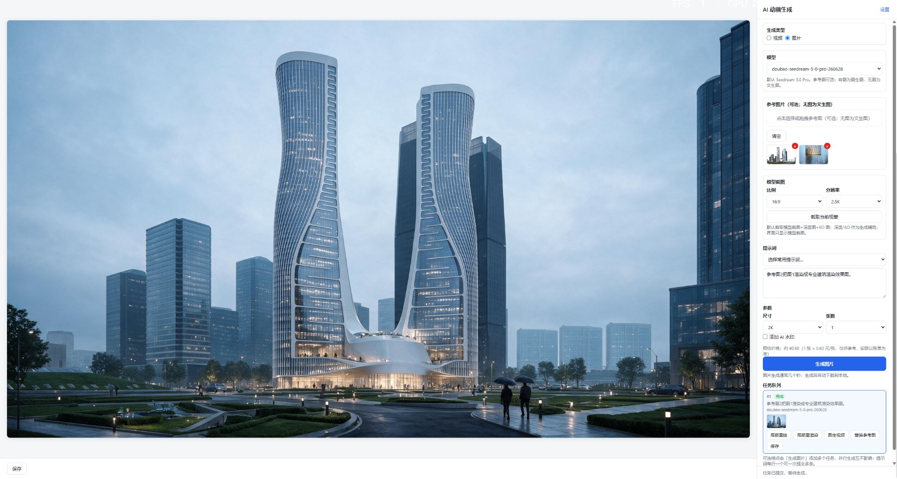

# rsAiAnimation · AI animation

> Module: AI / Video Generation

[← Back to command index](/en/commands/)

**Function**: This command is connected to ByteDance's self-developed Seedance / Seedream large model, which provides two generation types in the same window: the video mode is based on Seedance, with the reference image (required) as the core, and can superimpose reference video and reference audio for multi-modal video generation, or image-based video (first frame/first and last frame); the picture mode is based on Seedream, supports text-based images and image-based images (reference images are used to create image-generated images), and generates multiple results at one time. Both modes support multi-task concurrency, and the results are saved locally and can be previewed directly.

*Figure 1: AI animation generation main interface. "Settings" on the right side of the title bar is used to switch domestic/international service areas and configure API Key; the top of the main panel is the "Generation Type" switch (video=Seedance / picture=Seedream, both are ByteDance self-developed large models), and below are the model drop-down (default doubao-seedance-2-5-26028), reference picture upload (video is required, and can be dragged and dropped at least 1 (photo), reference video/reference audio (video mode optional, multi-modal reference or background music), prompt word textarea, the bottom is "Save video/save picture" and status bar Ready; the large block on the left is the result preview/history area. After the task is completed, the video will be played directly, and the pictures will be displayed in a thumbnail grid and can be saved in batches.*

*Figure 2: Example of reference graph schema generation. The large picture on the left is a night view rendering of the twisted twin tower building generated by the reference picture; the right side is the main interface of AI animation generation: generation type = picture, model = doubao-seedream-5-0-pro-26028, 2 thumbnails uploaded in the reference picture area (red × can be deleted), prompt word textarea, reference video/reference audio left blank, parameter size 2K/number of pictures 1. After the generation is completed, the status bar displays the completed tasks. The completed items in the task list at the bottom can be clicked to view/save the generated diagram.*

> Screenshots and videos may show a Chinese-language interface. Labels and control positions can vary by Rhino or RSTool version.

**Run**: Enter `rsAiAnimation` in the Rhino command line (opens a settings window).

**Workflow**:

1. Enter rsAiAnimation on the command line to open the AI animation window
2. For first time use, click "Settings" to select the service area (Domestic Volcano Ark / International BytePlus) and fill in ARK_API_KEY to save
3. Select Video or Picture in "Generate Type"
4. Video mode: add at least 1 reference picture (can drag/cut the window), optional reference video and audio; picture mode: enter prompt words and upload the reference picture to make a picture, or use pure text to make a picture without reference picture
5. Enter the prompt word and set parameters such as model, resolution/size, scale, duration (video), number of pictures (pictures), random seeds, etc.
6. Click "Generate": call byte Seedance (video) / Seedream (picture) large model generation, support multiple tasks submitted at one time
7. After the generation is completed, the results are automatically downloaded to the local temporary directory. You can play/view them in the preview area on the left, and click "Save" to export.

**Parameters**:

| Display name | Parameter | Type | Default | Range | Description |
| --- | --- | --- | --- | --- | --- |
| Generate type | genType | radio | video | Video/Picture | Top switch: Video=Seedance video generation, picture=Seedream Wenshengtu/Tushengtu (both are ByteDance large models) |
| Model | modelMain | select | Seedance 2.5 | Video: Seedance 2.5/2.0/1.5/1.0 (Domestic) or Dreamina-* (International)/Custom; Image: Seedream Series (switch by region) | The video defaults to Seedance 2.5 (video reference requires 2.0+); when switching to picture mode, the pull-down automatically switches to the Seedream series (domestic doubao-seedream-* / international seedream-*) |
| Reference pictures | refImages | file[] | — | image/* Multiple pictures (at least 1 picture must be selected in video mode; picture mode is optional for drawing reference) | Video mode: Use multi-modal reference if there is video, use picture to generate video (first frame/first and last frame) if there is no video; Picture mode: Generate as picture reference driver |
| Reference video | refVideo | file | — | Video file (optional) | Multi-modal video reference; only supported by Seedance 2.0/2.5, not supported by 1.5/1.0 |
| Reference audio | refAudio | file | — | Audio file (optional, background music) | Optional, as video background music reference |
| prompt word | prompt | textarea | — | arbitrary text | Video: Describe animation effects (lens advancement, light and shadow changes, architectural photography style); Picture: Describe screen content/style |
| resolution | resolution | list | 720p | 480p / 720p / 1080p / 4K | Video mode output resolution |
| Image size | imageSize | list | 1K | 1K / 2K / 3K / 4K | Picture mode output size (Seedream); this parameter is hidden in video mode |
| Number of pictures | imageCount | number | 4 | 1–10 | The number of group pictures generated at one time in picture mode; Seedream 5.0 pro does not support group pictures |
| Proportion | ratio | list | 16:9 | 16:9 / 4:3 / 1:1 / 3:4 / 9:16 / 21:9 / Adaptive | Aspect ratio; adaptive to the first frame picture size |
| Duration (seconds) | duration | number | 5 | 4–15, step size 1 | Generate video duration (seconds) |
| random seed | seed | number | -1 | Integer (-1 means random) | Fixed seeds can reproduce results |
| Generate audio | generateAudio | bool | open | on/off | Whether background audio is also generated by the model |
| fixed camera | cameraFixed | bool | close | on/off | After turning it on, the picture does not follow the camera movement of the reference video. |
| add watermark | watermark | bool | close | on/off | Whether to add AI-generated watermark to the resulting video |
| service area | region | select | cn (Domestic Volcano Ark) | cn domestic / intl international | Switching areas will switch the API address and model list at the same time (videos/pictures have different prefixes) |
| API Key | apiKey | password | — | ARK_API_KEY | API Key of Byte Ark/BytePlus; encrypted and saved to the local machine |
| API address | endpoint | text | https://ark.cn-beijing.volces.com/api/v3 | URL | Automatically populates with the region, and the proxy address can be changed |

**Notes**: The bottom layer calls ByteDance's Seedance (video) / Seedream (picture) large model. It is called through the Volcano Ark (domestic ark.cn-beijing.volces.com) or BytePlus (international ark.ap-southeast.bytepluses.com) interface. You need to prepare your own ARK_API_KEY. Video: with reference video → multi-modal reference (only 2.0/2.5), without video → image-generated video (first frame/first and last frame); picture: image-generated image is driven by reference image, or without reference image and text. To switch between domestic and international, you need to switch the interface address and model ID at the same time: the video model is domestic doubao-seedance-*, the international dreamina-seedance-*, the picture model is domestic doubao-seedream-*, the international seedream-* (5.0 pro does not support picture grouping). It usually takes 1~5 minutes to generate, the higher the duration/resolution, the longer it will take; pictures are charged on a per-picture basis

**Tutorial videos**:

<iframe class="rstool-video" src="https://player.bilibili.com/player.html?isOutside=true&aid=117157279044608&bvid=BV1gYhj6CEvU&cid=41265071172&p=1" scrolling="no" border="0" frameborder="no" framespacing="0" allowfullscreen="true" loading="lazy" title="[RsTool] Byte's large image model is finally ready? Builders are ecstatic!"></iframe>
*[RsTool] Byte's large image model is finally ready? Builders are ecstatic!*
