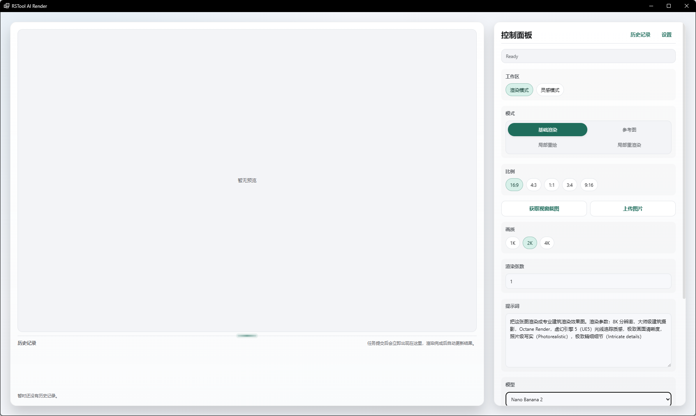
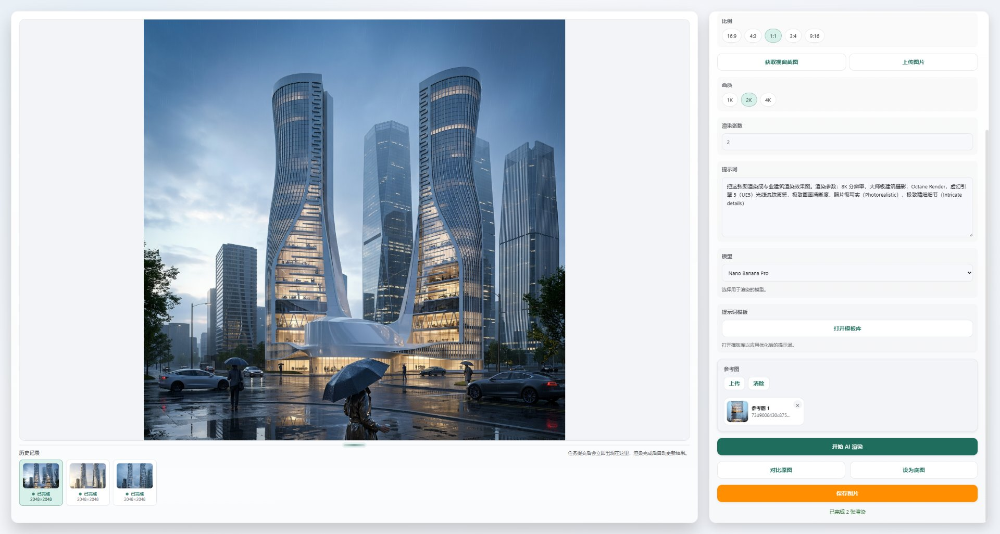
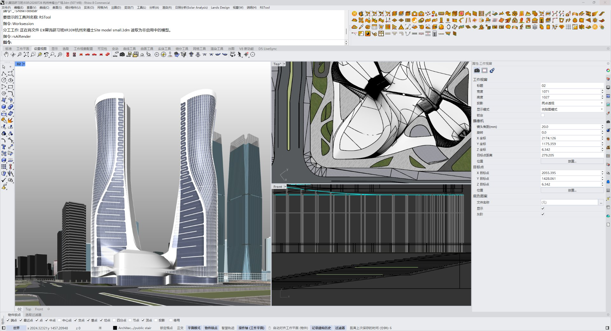
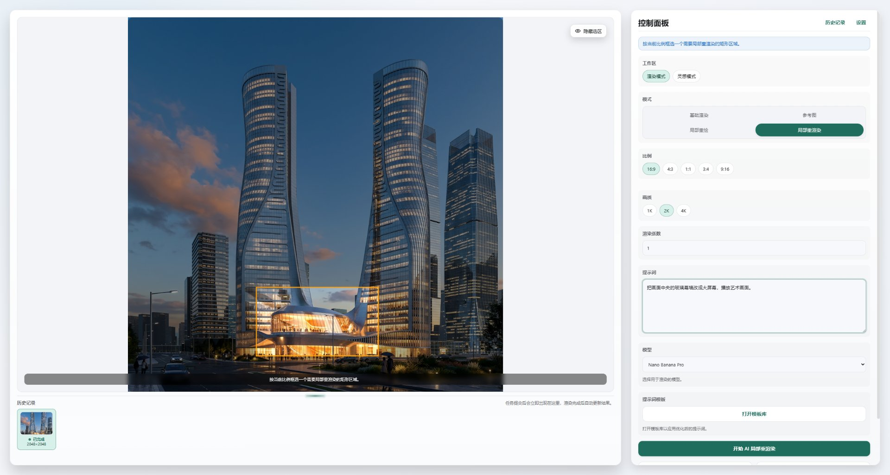
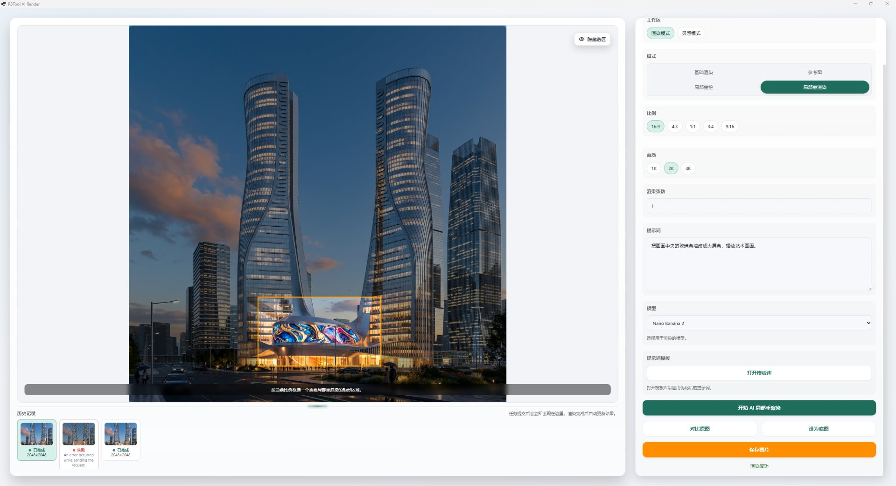
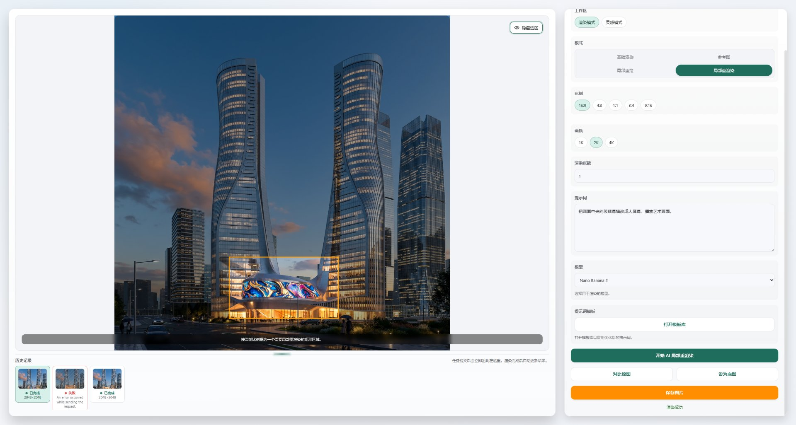

# rsAiRender · AI rendering

> Module: AI / Rendering & Modeling

[← Back to command index](/en/commands/)

**Function**: You can take a screenshot of the model in Rhino, or upload a specific image and send it to Gemini or ChatGPT for AI rendering. After rendering is completed, partial redrawing or partial replacement can be performed. It is recommended to directly intercept the model in Rhino for AI rendering - this command will automatically intercept the depth map, AO map and other information to supplement it, ensuring a more realistic rendering effect. This command can either directly use the personal registration API or the transfer station service API provided by Yoluoren.

*Figure 1: Overview of the control panel. Preview area + history on the left, and from top to bottom on the right are the ratio 1:1/16:9/4:3/3:4/9:16 and the "Get high-definition screenshot/upload image" button, image quality 1K/2K/4K, number of renderings, prompt words (supports template library), model drop-down, prompt word template, reference image upload*

*Figure 2: Reference image rendering example. Upload the screenshot of the site model exported by Rhino as a reference image. The prompt word describes the futuristic super high-rise glass curtain wall. The AI rendering parameters are 3:4 ratio + 2K resolution + Nano Banana Pro model. While maintaining the building volume, outline and urban environment atmosphere, AI translates the shape of the reference image into a realistic material in the night scene and rain. You can see 3 different results in the historical records below for comparison.*

*Figure 3: Rhino workspace from the case study. The Perspective viewport on the left shows two curved super high-rise buildings, the Top viewport on the right is plane positioning, and the background is Site model · small.bim; use the "Get HD Screenshot" of this view to bring in RsTool AI Render as a reference image (you can also replace it with other perspectives/materials in "Upload Image")*

*Figure 4: Partially redrawn workbench. After the mode is switched to "Basic Rendering/Partial Redrawing", a "Hide Selection" button appears at the top of the preview area. You can drag a rectangular selection on the screen with the mouse (here is the podium at the bottom of the building). Enter the prompt on the right "Inject the podium in the center of the screen with streamers into the screen to add artistic light." Redraw the frame selection range. Model Nano Banana Pro, 2K, 3:4. Click "Start AI Partial Re-rendering" to leave other areas unchanged.*

*Figure 5: Failure can be retried. The first redraw failed after the model was switched to Nano Banana 2. The second entry in the history record is marked in red with "An error occurred while executing the...", but the original image of the first entry can still be used as the working base map - directly adjust the prompt word or switch back to Nano Banana Pro to redraw, without having to start from scratch.*

*Figure 6: Partial redraw successful. Status bar "Complete·Rendering Successful" + top Rendering Success prompts that the third entry in the history displays the current result (Nano Banana 2) with a green "Complete" badge. Other areas (sky, towers, streets) remain unchanged from the previous version, and only the podium in the selected range is redrawn - this is the core advantage of "partial redrawing" over "whole image re-rendering": the iteration only affects the area you want to change.*

> Screenshots and videos may show a Chinese-language interface. Labels and control positions can vary by Rhino or RSTool version.

**Run**: Enter `rsAiRender` in the Rhino command line (opens a settings window).

**Workflow**:

1. Enter rsAiRender on the command line to open the AI ​​rendering window (if it is open, it will be brought to the front)
2. Select the API access point (Yuluoren/Official/Custom) on the "Settings" page and fill in the API Key
3. Switch the "Rendering Mode/Inspiration Mode" workspace
4. In the rendering mode, select the mode (Basic rendering/Reference image/Partial redrawing/Partial re-rendering), capture the window or upload a picture as a base map as needed
5. Set the ratio, image quality, and number of renderings, and describe the material/style/light/perspective/lens details in the "Prompt Word" (you can click "Open Template Library" to apply the default)
6. Select the model (Nano Banana 2 / Nano Banana Pro / GPT Image 2) and click "AI Render"
7. The results automatically appear in the preview area and the history bar below. You can use "Compare original image", "Set as base image" and "Save image"
8. The inspiration mode supports three workflows: "Imagination/Mixed Pictures/Picture Prompt Words", and the "Architectural Inspiration Word Prompt Tool" can be called to assemble the prompt words.

**Parameters**:

| Display name | Parameter | Type | Default | Range | Description |
| --- | --- | --- | --- | --- | --- |
| workspace | workspace | chip | render | render / inspiration | Switching between rendering mode and inspiration mode; the former is oriented towards architectural representation, and the latter is oriented towards early image exploration |
| mode | mode | chip | base | base / reference / inpaint / localRerender | Sub-modes in rendering mode: basic rendering (pure textual drawing), reference drawing (overlapping multiple references), partial redrawing (framed area + annotation), partial re-rendering (redrawing of a fixed rectangle according to the current proportion) |
| Proportion | aspectRatio | chip | 16:9 | 16:9 / 4:3 / 1:1 / 3:4 / 9:16 | Output frame ratio; switching the ratio under the GPT Image 2 model will simultaneously reset the output resolution corresponding to the image quality. |
| Image quality | resolutionIndex | chip | 1 | 1K/2K/4K (or high/medium/low corresponding to the model) | Output resolution level; GPT Image 2 is mapped according to the current ratio of 1280x720 → 3840x2160 in three sizes, and other models are mapped in three sizes: high/medium/low |
| Number of renderings | renderCount | number | 1 | 1–20 | The number of parallel images submitted at one time; if it exceeds 20, it will be automatically clipped to 20; multiple results will be entered into the history one by one when submitted. |
| prompt word | prompt | textarea | Photorealistic architectural rendering, sunny day, high detail, 8k resolution | arbitrary text | Prompt words for rendering/partial redrawing/partial re-rendering are saved separately according to mode (one copy each for base/reference/inpaint/localRerender); you can click "Open Template Library" to call the default |
| Reference picture | referenceImages | file[] | — | image/png, jpeg, webp, bmp, single file ≤30MB | "Reference Picture" and "Partial Redraw" modes are available, and uploading multiple pictures at the same time affects the generation; "Inspiration Material Picture" is also supported in Inspiration Mode |
| Inspiration workflow | inspirationMode | chip | imagine | imagine / blend / describe | Only visible in the inspiration workspace: imagination (pure text inspiration), mixed pictures (combining the current window + material pictures), picture prompt words (reverse the current view into prompt words) |
| inspiration words | inspirationPrompt | textarea | — | arbitrary text | The main input of the inspiration workspace; you can click "Prompt Word Tool" to call up the "Architectural Inspiration Word Prompt Tool" and assemble it in 10 dimensions according to building type/design style/volume strategy/facade material/site/light/lens/scene/sustainability/image expression |
| Model | selectedModel | select | gemini-3.1-flash-image-preview | gemini-3.1-flash-image-preview (Nano Banana 2) / gemini-3-pro-image-preview (Nano Banana Pro) / gpt-image-2 | Image rendering model; Nano Banana 2 is faster, Nano Banana Pro has better quality, and GPT Image 2 has more detailed resolution mapping |
| API access point | endpointType | radio | yoro | yoro / official / custom | Switch in "Settings": Yoluoren API (recommended) / official API / custom API; when selecting custom, you need to fill in the complete endpoint URL and specify the protocol (auto/gemini/generic) |
| theme | theme | radio | System | System / Light / Dark | UI theme, follow system/light/dark; switching takes effect immediately |

**Notes**: Internet connection is required; all parameters are set in the window and encrypted and saved to the local configuration. Prompt word templates, inspiration tool presets, reference pictures and historical records are all saved to the local machine.
