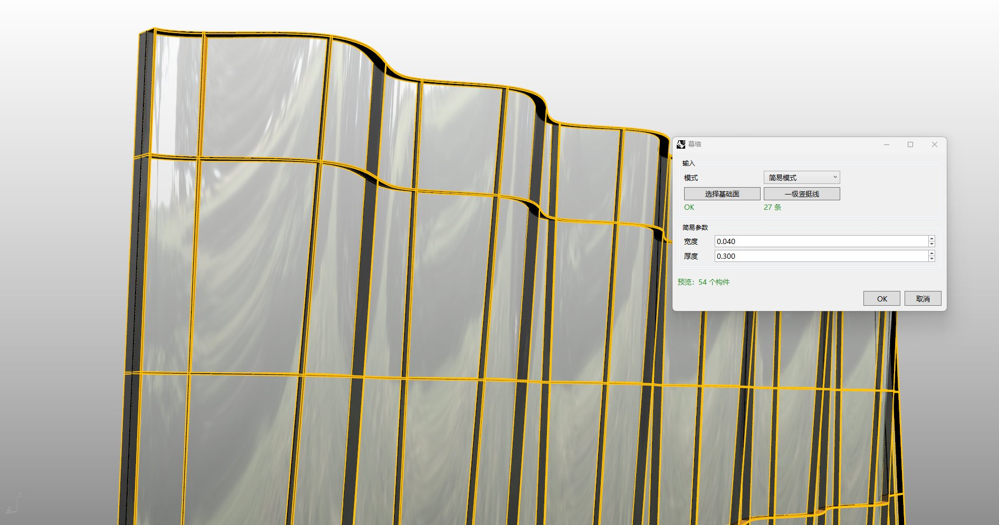
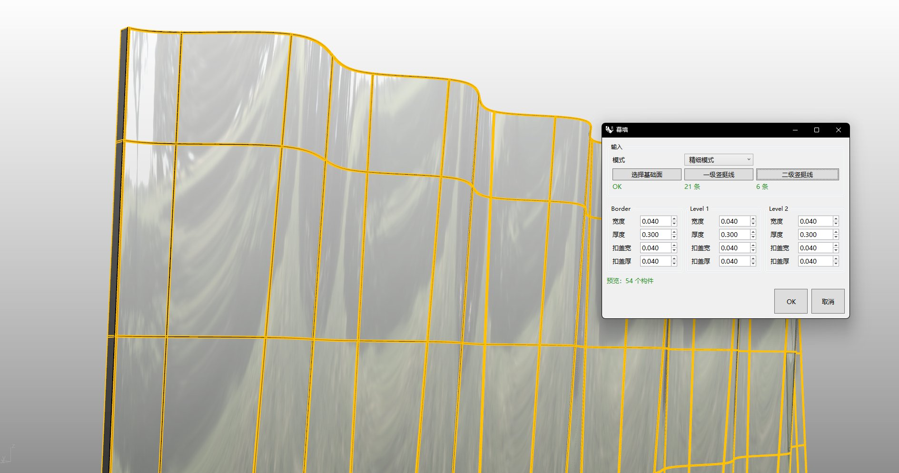

# rsCurtain · Curtain wall

> Module: Architecture / Building Elements

[← Back to command index](/en/commands/)

**Function**: Generate curtain wall (outer frame/vertical/buckle cover) based on basic surface and vertical reference lines

*Eto "Curtain Wall" simple mode window: After selecting the basic surface and vertical lines, you only need to set the width/thickness of the outer frame to generate a basic curtain wall based on the number of vertical lines. The estimated number of components is displayed in real time at the bottom*

*Eto "curtain wall" fine mode window: On top of the basic surface and vertical lines, select secondary vertical lines. The outer frame/primary/secondary verticals each have independent width, thickness, buckle cover width and thickness, flexibly generating a multi-level curtain wall system*

> Screenshots and videos may show a Chinese-language interface. Labels and control positions can vary by Rhino or RSTool version.

**Run**: Enter `rsCurtain` in the Rhino command line (opens a settings window).

**Workflow**:

1. Select base surface (Brep)
2. (Optional) Select primary/secondary vertical guide lines
3. Set the frame/vertical/cover size and curtain wall mode in the dialog box
4. Generate curtain wall

**Parameters**:

| Display name | Parameter | Type | Default | Range | Description |
| --- | --- | --- | --- | --- | --- |
| Frame width | BoderWidth | double | 0.04 | >0 | Unit: meter |
| Frame thickness | BoderThick | double | 0.3 | >0 | Unit: meter |
| Buckle cover width | CapWidth | double | 0.04 | >0 | Unit: meter |
| Buckle cover thickness | CapThick | double | 0.04 | >0 | Unit: meter |
| First level vertical width | FirstMullionWidth | double | 0.04 | >0 | Unit: meter |
| First level vertical thickness | FirstMullionThick | double | 0.3 | >0 | Unit: meter |
| First level buckle cover width | FirstCapWidth | double | 0.04 | >0 | Unit: meter |
| First level buckle cover thickness | FirstCapThick | double | 0.04 | >0 | Unit: meter |
| Secondary vertical width | SecondMullionWidth | double | 0.04 | >0 | Unit: meter |
| Secondary vertical thickness | SecondMullionThick | double | 0.3 | >0 | Unit: meter |
| Secondary buckle cover width | SecondCapWidth | double | 0.04 | >0 | Unit: meter |
| Secondary buckle cover thickness | SecondCapThick | double | 0.04 | >0 | Unit: meter |
| curtain wall mode | CurtainMode | int | 0 | enum index | Curtain wall mode enumeration (see source code) |
