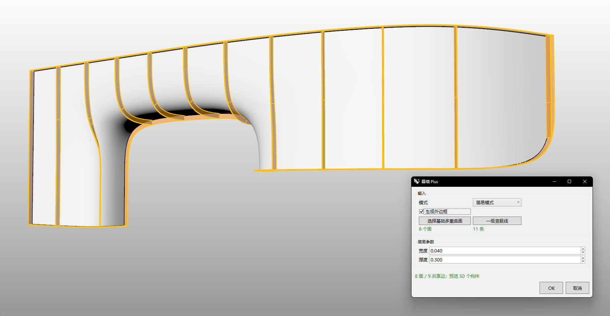
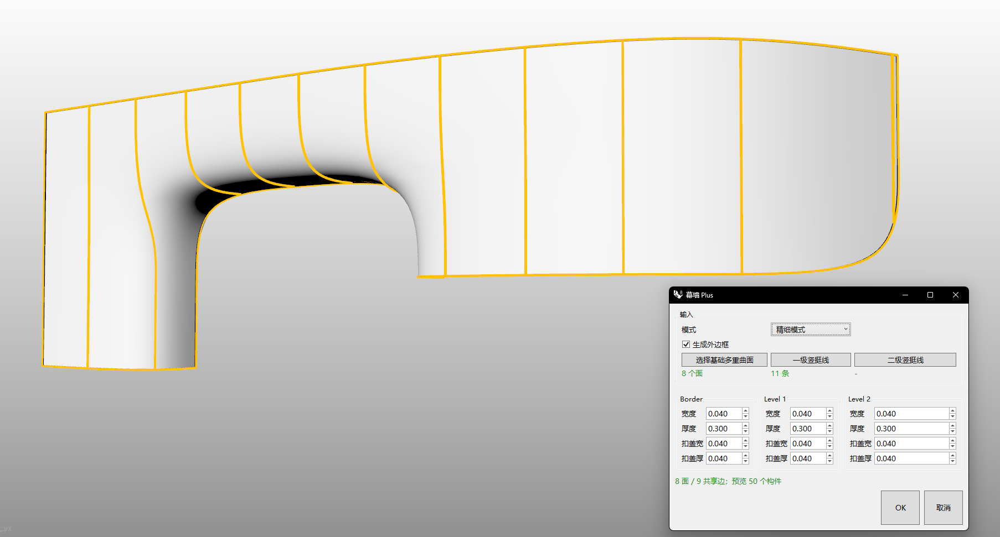

# rsCurtainPlus · Enhanced Curtain Wall

> Module: Architecture / Building Elements

[← Back to command index](/en/commands/)

**Function**: Generate curtain wall based on basic Brep and vertical lines (supports simple/fine mode and angled components)

*Eto "Curtain Wall Plus" simple mode window: select the basic Brep and the first/secondary vertical line to generate the curtain wall; compared to rsCurtain, the upgrade point is to support multiple surfaces (pick up multiple surfaces at one time to merge and generate), and automatically process G0 hemming*

*Eto "Curtain Wall Plus" fine mode window: On top of the simple mode, the width, thickness, buckle cover width and buckle cover thickness of the outer frame/primary/secondary verticals are independently adjustable; the G0 folding edge automatically generates corner components, which can cope with complex scenes with multiple curved surfaces and folding edges.*

> Screenshots and videos may show a Chinese-language interface. Labels and control positions can vary by Rhino or RSTool version.

**Run**: Enter `rsCurtainPlus` in the Rhino command line (opens a settings window).

**Workflow**:

1. Open the Curtain Wall Plus dialog box
2. Select the base polysurface (Brep)
3. (Optional) Select primary/secondary risers
4. Select mode (easy/fine) and whether to generate outer borders
5. Set the size of each component
6. Generate curtain wall (including automatic processing of G0 corners)

**Parameters**:

| Display name | Parameter | Type | Default | Range | Description |
| --- | --- | --- | --- | --- | --- |
| mode | Mode | list | 0 | Simple\|Sophisticated | 0=Simple, 1=Detailed |
| Generate outer border | GenerateBorder | bool | false | true\|false | Available in fine mode |
| Width | Width | double | 0.04 | >0 (min max(tol,0.001m)) | The default width value shared by simple/outline/level 1/level 2, unit: meters |
| Thickness | Depth | double | 0.3 | >0 (min max(tol,0.001m)) | Unit: meter |
| Buckle cover width | CapW | double | 0.04 | >0 (min max(tol,0.001m)) | Fine mode frame/level 1/level 2, unit: meters |
| Thick buckle cover | CapD | double | 0.04 | >0 (min max(tol,0.001m)) | Fine mode frame/level 1/level 2, unit: meters |

**Notes**: G0 folding automatically generates corner components; in fine mode, the outer frame/level 1/level 2 each have independent width, thickness, buckle cover width, and buckle cover thickness.
