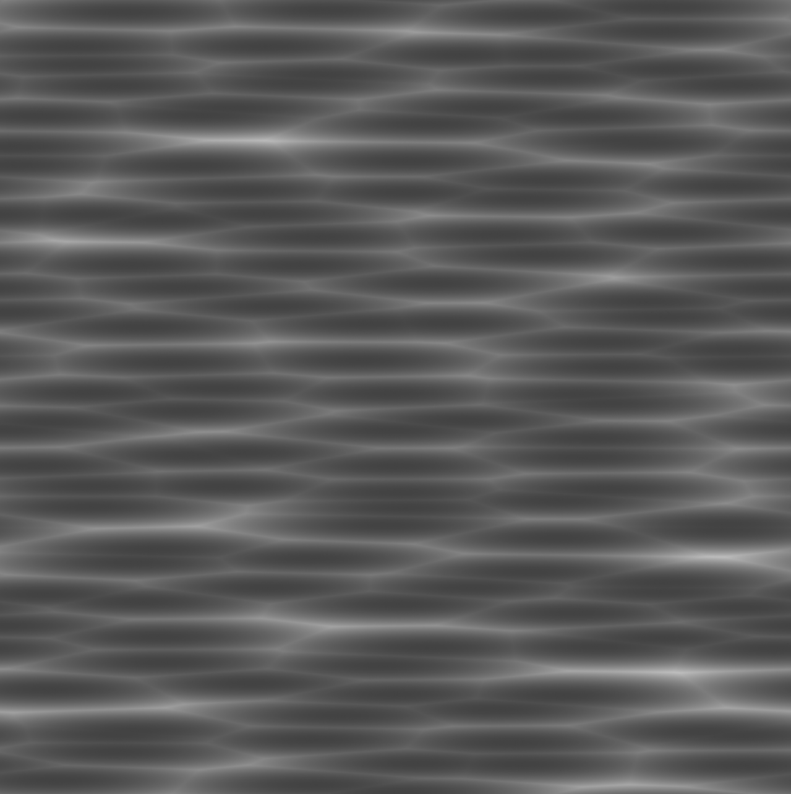
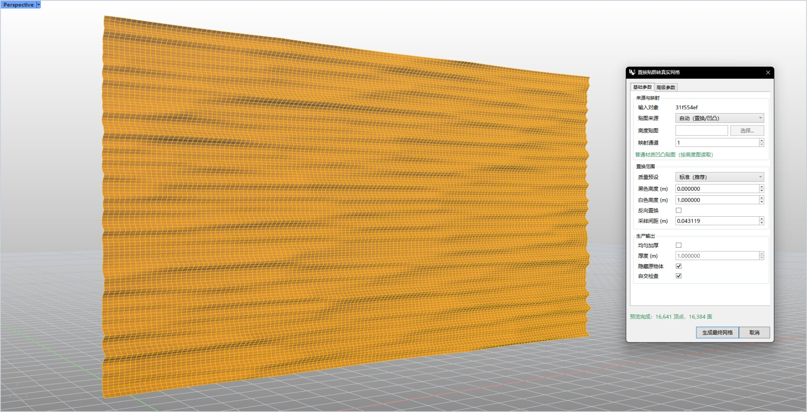
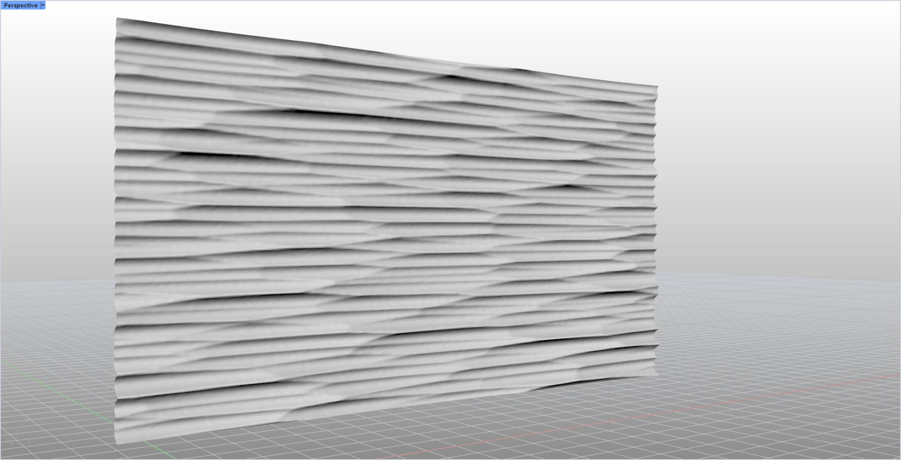

# rsDisplacementToMesh · Displacement map to real mesh

> Module: Geometry / Meshes

[← Back to command index](/en/commands/)

**Function**: The result mesh is added to the current document with the name &lt;source object name or "Displaced"&gt;_Displaced and is automatically selected; the source object is retained at the same time (unless "Hide original object" is checked) Turn off the displacement display of the result object (Displacement.On=false and clear the children) to avoid overlaying with the real geometry Clone a rendering material without displacement (named "Baked Displacement" or original name + (Baked)) and attach it to the result to ensure consistent export/rendering Write UserString for easy tracing: RsTool.Type=DisplacementMesh, RsTool.SourceObjectId (source object GUID), RsTool.FaceCount, RsTool.IsClosed, RsTool.SelfIntersectionCount During the preview stage, an orange translucent DisplayConduit is used for real-time overlay display; the final mesh is generated under a controlled control based on the "maximum number of faces" and can be canceled midway.

*Grayscale noise map used to drive displacement: horizontally undulating tube/ribbon texture, mid-tone grayscale (no pure white, pure black) imported into "Manual Height Map" as height source or automatically read from Rhino displacement/bump material*

*Rhino viewport screenshot: The large orange-yellow display on the left is the mesh with displacement map (Rhino selected state coloring). The floating window on the right is the "Displacement Map to Real Mesh" parameter dialog box of this command, which is divided into two tabs "Basic Parameters/Advanced Parameters"; the bottom shows the number of preview vertices and faces in real time.*

*The actual geometry generated after applying the noise map: the surface shows dense relief-like stripes, with raised light bands and depressed dark bands; grayscale display highlights the concave-convex contrast, and the background mesh is retained to show context*

> Screenshots and videos may show a Chinese-language interface. Labels and control positions can vary by Rhino or RSTool version.

**Run**: Enter `rsDisplacementToMesh` in the Rhino command line (opens a settings window).

**Workflow**:

1. Enter rsDisplacementToMesh on the command line and follow the prompts to select the Mesh / Brep / Surface / SubD object to be baked (pre-selection is supported, just select it before commanding)
2. Automatically read the displacement/bump material settings of the object; if the reading fails, it will automatically fall back to the "manual height map" mode, and you need to specify the height map yourself.
3. The "Displacement Map to Real Mesh" dialog box pops up. Set the source, displacement range, production output and precision limits in the two tabs of "Basic Parameters/Advanced Parameters"
4. A safe preview is automatically calculated in about 0.35 seconds after any parameter is changed (vertex-by-vertex replacement, up to 20,000 faces, displayed in real time with an orange translucent mesh)
5. Click "Generate Final Mesh" to generate a controlled final mesh (strictly abide by the upper limit of "Maximum Number of Faces" and can be canceled midway); if "Uniform Thickening" is not turned on and there are warnings in the quality report, a pop-up window will pop up to confirm whether to still add it to the document.
6. The result is added to the document as &lt;original name&gt;_Displaced and automatically selected; check "Hide original object" to hide the source object, cancel it to not hide it and redisplay it.

**Parameters**:

| Display name | Parameter | Type | Default | Range | Description |
| --- | --- | --- | --- | --- | --- |
| Texture source | Texture source | list | Automatic (displacement/bump) | Auto (displacement/bump)/manual height map | Only after switching to "Manual Height Map" can the height map file be selected. |
| height map | Height bitmap | file | (Manual mode selection) | .png .tif .tiff .jpg .jpeg .bmp | Only the "Manual Height Map" mode is available, load the grayscale height map through the "Select..." button |
| mapping channel | Mapping channel | int | Automatic reading (manual default 1) | 1–99 | UV channel number used for heightmap sampling |
| Quality preset | Quality preset | list | Standard (recommended) | Fast (preview first) / Standard (recommended) / Fine / Custom | Switching the default will apply the corresponding sampling spacing, thinning, welding, smoothing and number of faces/memory limit; modifying the advanced parameters will automatically switch to "Custom" |
| black height | Black height | double | With preset/auto | -Object size × 10… + Object size × 10 (model units) | The displacement corresponding to the black pixel in the height map; positive is outward along the normal line |
| white height | White height | double | With preset/auto | -Object size × 10… + Object size × 10 (model units) | The displacement corresponding to the white pixel in the height map |
| reverse permutation | Reverse direction | toggle | false | on/off | Reverse displacement direction (black/white height swap, flip in/out) |
| Sampling interval | Sweep pitch | double | With default | ≥ Model tolerance … object size × 10 | mesh edge sampling step size; the smaller, the higher the detail but the slower |
| Evenly thickened | Solidify | toggle | false | on/off | Close the thin shell replacement result as a solid and give the thickness; automatically turn on and lock the "self-intersection check" after opening it |
| Thickness | Thickness | double | With default (can be set after opening Solidify) | ≥ Model tolerance … object size × 10 | Editable only when "Uniform Thickening" is turned on, the thickness of the solid shell |
| Hide original object | Hide original | toggle | false | on/off | Hide source object after generation; cancel to retain and redisplay |
| self-inspection | Self-intersection check | toggle | false | On/Off (force true when Solidify is on) | Detect whether the replaced epidermis is self-crossing; it is locked when opening Solidify |
| Number of refinements | Refine steps | int | With default | 0–8 | After sampling, do several rounds of edge subdivision and refinement to improve details. |
| Refinement sensitivity | Refine sensitivity | double | With default | 0–1 | Controls how sensitive thinning is to changes in curvature |
| Welding angle (degrees) | Post-weld angle | double | With default | 0–180 | Weld adjacent faces whose normal angle is less than this value to create a smooth joint. |
| Smoothing times | Fairing passes | int | With default | 0–100 | After generation, perform several rounds of smoothing on the mesh to reduce aliasing. |
| Maximum number of sides | Face limit | int | With default | 1000–50000000 | There is a hard upper limit on the number of final mesh faces to prevent the results from getting out of control and getting stuck. |
| Memory limit (MB) | Memory limit (MB) | int | With default | 64–32768 | Maximum memory usage of the generation process |

**Notes**: Displacement map vs real mesh: Rhino's displacement only shows fluctuations when rendering. This command "bakes" it into a truly editable, Boolean, and exportable mesh geometry, suitable for processing / 3D printing / downstream software Automatic source detection: Prioritize reading the PBR displacement or bump map of the object; when a suspected normal map is detected (the normal map is not a height map), the status bar displays an orange warning. At this time, you should switch to "Manual Height Map" to specify the correct grayscale height map. Separation of preview and final: Preview of up to 20,000 faces, allowing for rapid iteration of parameters; the final mesh strictly adheres to the "maximum number of faces", with more complete details but more time-consuming, and can be canceled Production risk: Thin shell replacement is prone to self-crossing/overturning. If "Uniform Thickening" is not turned on, if there is a warning in the quality report, a pop-up window will prompt, and the document will be added after confirmation; turning on "Uniform Thickening" can be closed as an entity and forced self-crossing inspection Performance and loss-of-control protection: The smaller the sampling interval and the more times of refinement, the higher the detail but the longer it takes; the "maximum number of faces" and the "memory limit" are two insurances to prevent large models from getting stuck/exploding memory Tracing and collaboration: The output object has UserString such as RsTool.Type=DisplacementMesh. You can use scripts to filter by type and check the source object by SourceObjectId.
