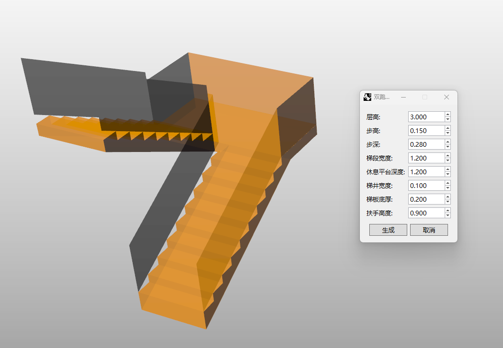

# rsDoubleFlightStairs · Double-Flight Staircase

> Module: Architecture / Stairs & Ramps

[← Back to command index](/en/commands/)

**Function**: Double running stairs (including landing and handrails)

*After picking the base point and direction point, a double-running staircase is generated in real time, including a landing, stairwell, and handrails, and all parameters are adjusted in the dialog box*

> Screenshots and videos may show a Chinese-language interface. Labels and control positions can vary by Rhino or RSTool version.

**Run**: Enter `rsDoubleFlightStairs` in the Rhino command line (opens a settings window).

**Workflow**:

1. Select stair base point
2. Select direction point
3. Set parameters in dialog box
4. Real-time preview and generation of double-running stairs (including landing and handrails)

**Parameters**:

| Display name | Parameter | Type | Default | Range | Description |
| --- | --- | --- | --- | --- | --- |
| Floor-to-floor height | FloorHeight | double | 3.0 | 0.01~10000 | Step 0.1, unit: meters |
| Riser height | StepHeight | double | 0.15 | 0.001~1000 | Step 0.01, unit: meters |
| Tread depth | StepDepth | double | 0.28 | 0.001~1000 | Step 0.01, unit: meters |
| Flight width | FlightWidth | double | 1.2 | 0.01~10000 | Step 0.1, unit: meters |
| Landing depth | LandingLength | double | 1.2 | 0.01~10000 | Step 0.1, unit: meters |
| Stairwell gap | GapWidth | double | 0.1 | 0~10000 | Step 0.1, unit: meters |
| Stair slab thickness | BottomHeight | double | 0.2 | 0~10000 | Step 0.1, unit: meters |
| Handrail height | HandrailHeight | double | 0.9 | 0~10000 | Step 0.1, unit: meters |

**Notes**: The dialog box is non-modal and the base point and direction point can be picked at the same time.
