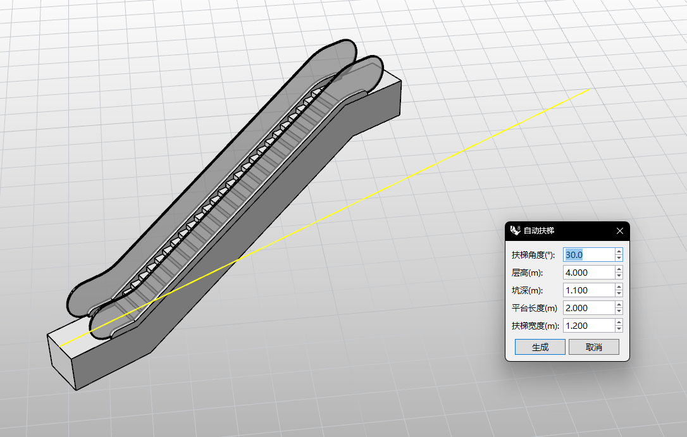

# rsEscalator · Escalator

> Module: Architecture / Stairs & Ramps

[← Back to command index](/en/commands/)

**Function**: Generate an escalator along the base line: join the Rhino document as a Brep list, including steps (step join), left and right handrails (fillet), left and right hand straps, and a glass panel named "EscalatorGlass"

*rsEscalator pops up the "Escalator" Eto dialog box (5 parameters + two buttons to generate/cancel), and the Rhino viewport has generated components such as steps, handrails, and glass railings based on the basic line (yellow guide line).*

> Screenshots and videos may show a Chinese-language interface. Labels and control positions can vary by Rhino or RSTool version.

**Run**: Enter `rsEscalator` in the Rhino command line (opens a settings window).

**Workflow**:

1. Enter rsEscalator on the command line, and you will be prompted to select the escalator base line (must be a Rhino straight line)
2. The base line determines the direction and location of the escalator; the terminal side will be raised to the "floor height" elevation.
3. The "Escalator" Eto dialog box pops up (the title and field labels follow the Rhino language settings)
4. Adjust 5 parameters in the dialog box: escalator angle/floor height/pit depth/platform length/escalator width
5. Click "Generate" to build the escalator components (steps/left and right handrails/glass railings) along the basic line, and "Cancel" to give up.

**Parameters**:

| Display name | Parameter | Type | Default | Range | Description |
| --- | --- | --- | --- | --- | --- |
| Floor-to-floor height | FloorHeight | double | 4 | 0.1~20000 | The total height difference between the top and bottom ends of the escalator determines the elevation of the top of the escalator; step 0.1, 3 decimal places, unit: meters |
| The pit is deep | PitDepth | double | 1.1 | 0.1~10000 | The depth of the recess at the bottom of the escalator (the space formed by the recessed floor) determines the recessed position of the starting end; step 0.1, 3 decimal places, unit: meters |
| Platform length | PlatformLength | double | 2 | 0.1~10000 | The length of the horizontal access platforms at both ends of the escalator determines the size of the upper and lower transition platforms; step 0.1, 3 decimal places, unit: meters |
| Escalator width | EscalatorWidth | double | 1.2 | 0.5~10000 | The clear transverse width of the escalator steps determines the passable width; step 0.1, 3 decimal places, unit: meters |
| escalator angle | EscalatorAngle | double | 30.0 | 5~60 | Escalator inclination angle; step 1, 1 decimal place, unit: degree. NumericStepper is limited to 5~60; IsValid additionally determines 0<angle<90 |

**Notes**: rsEscalator is an Eto dialog-based command, with only 5 numerical parameters in the pop-up window; this input will be written into the RsEscalator.EscalatorWidth / EscalatorAngle static field, which will be automatically brought in next time it is opened.

The dialog box title and field labels follow the Rhino language settings: the Chinese environment is "Escalator / Floor Height (m) / Pit Depth (m) / Platform Length (m) / Escalator Width (m) / Escalate Angle (°)", and the English environment is "Escalator / FloorHeight(m) / Depth(m) / PlatformLength(m) / Width(m) / EscalateAngle(°)". The window is positioned at 1/3 of the screen by default; the buttons "Generate" and "Cancel" are in Chinese and English.

Verification logic: The escalator angle is limited by NumericStepper to 5~60, and IsValid additionally determines 0<angle<90; the other four dimensions are required to be greater than 0. If the verification fails, it will not be generated.

Material and basic line: When the rendering material EscalatorGlass does not exist, the basic material will be automatically created and assigned to the glass railing; the basic line must be a Rhino straight line (Line), and the escalator will be built along this direction after selecting it on the command line GetObject.

⚠️ Source code details: rsEscalatorArgs field name is FloorHeigt (one less ‘t’, source code spelling bug), the document en uses FloorHeight which is a standardized way of writing to avoid exposing clerical errors to GH/external callers.
