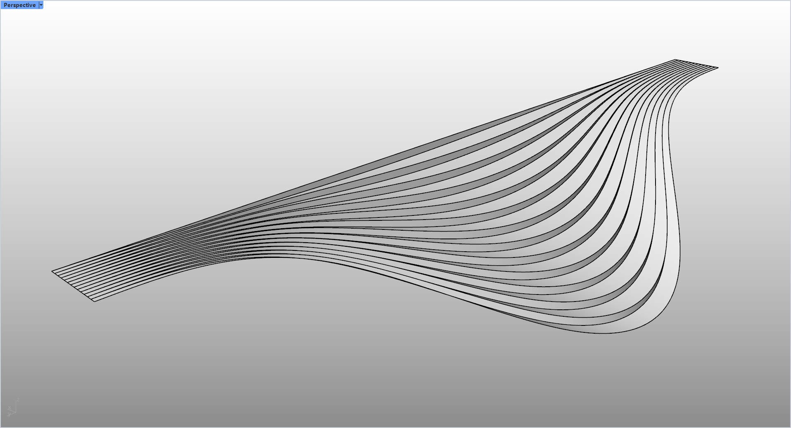

# rsFadingStairVertical · Vertical Tapered Staircase

> Module: Architecture / Stairs & Ramps

[← Back to command index](/en/commands/)

**Function**: Vertical evanescent staircase Brep

*The difference from rsFadingStair: the tread is completely vertical (the tread of rsFadingStair fades out along the curve, this command keeps the tread vertical, and only the height of the tread fades away)*

> Screenshots and videos may show a Chinese-language interface. Labels and control positions can vary by Rhino or RSTool version.

**Run**: Enter `rsFadingStairVertical` in the Rhino command line (command-line interaction).

**Workflow**:

1. Select two base curves
2. Enter the number of steps
3. Generate vertical evanescent staircase Brep

**Parameters**:

| Display name | Parameter | Type | Default | Range | Description |
| --- | --- | --- | --- | --- | --- |
| Number of steps on stairs | StepCount | int | 12 | 1~999 | Default 12 |
