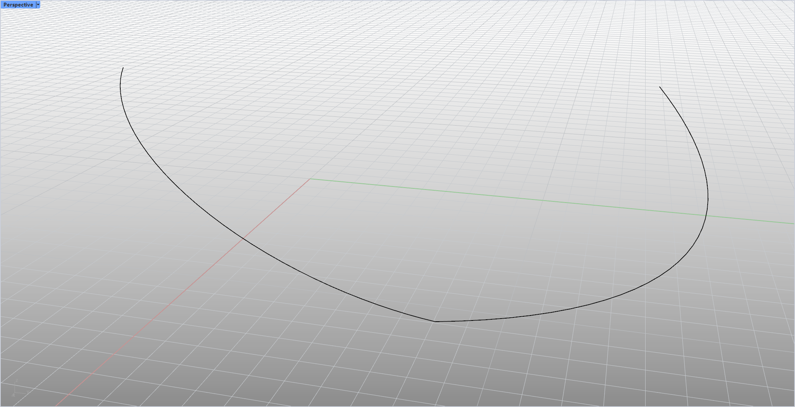
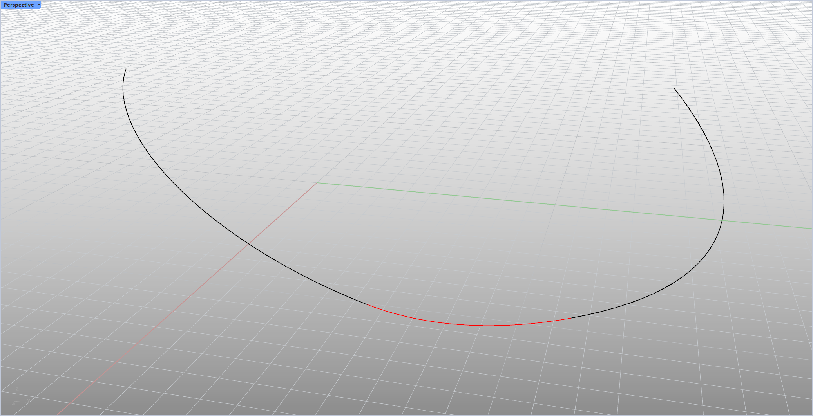

# rsFilletNonPlanar · Fillet Non-Planar Curves

> Module: Geometry / Curves

[← Back to command index](/en/commands/)

**Function**: Replace the original curve with the end truncated segment, and generate a G1 continuous non-coplanar fillet curve (NurbsCurve) between the ends of the two curves, and automatically select it.

*Figure 1: Before chamfering. In the Rhino Perspective viewport (the Perspective label in the upper left corner, the red and green coordinate axes are at the bottom and left) is a 3D space curve. The overall shape is U-shaped/bowl-shaped and concave. The curve has a sharp corner in the center of the bottom (two line segments directly intersect). The state before chamfering*

*Figure 2: After chamfering. For the same 3D curve, the sharp corner at the bottom has been replaced by a red NurbsCurve arc (command execution result), and the fillet radius is controlled by the rsFilletNonPlanar radius parameter; the G1 continuous implementation of the command is to project the curve onto the fitting plane and then fillet it, and then pull the fillet segment back to the original 3D space. The connection between the chamfered segment and both ends of the original curve remains G1 continuous.*

> Screenshots and videos may show a Chinese-language interface. Labels and control positions can vary by Rhino or RSTool version.

**Run**: Enter `rsFilletNonPlanar` in the Rhino command line (command-line interaction).

**Workflow**:

1. Command line input rsFilletNonPlanar
2. Enter the corner radius
3. Select the first curve near the end
4. Select the second curve near the end
5. Automatically fit projection planes and generate non-coplanar G1 fillets

**Parameters**:

| Display name | Parameter | Type | Default | Range | Description |
| --- | --- | --- | --- | --- | --- |
| corner radius | radius (m_radius) | double | 1.0 | ≥ model absolute tolerance, maximum double.MaxValue | Static variables remember the last value; the lower limit of GetNumber is doc.ModelAbsoluteTolerance |

**Notes**: Automatically flip the curve according to the pick point close to the starting point/end point; make a fillet on the fitting plane (make PlanarProjection to the plane) and then pull it back into the three-dimensional space while maintaining G1 continuity.
