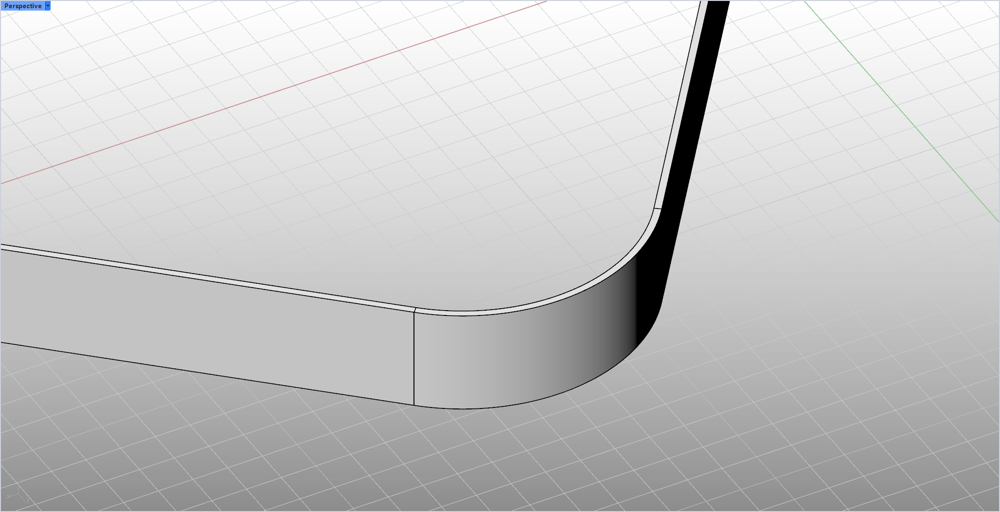

# rsFilletWall · Fillet Wall Corners

> Module: Architecture / 3D Walls

[← Back to command index](/en/commands/)

**Function**: Make arc chamfers on two smart walls

*Arc chamfering result of rsFilletWall (After): White model rendering under Rhino 8 perspective viewport (without UI panel), two smart walls with the same thickness complete a smooth transition at the lower right corner of the foreground - the outer facade of the wall forms an obvious arc corner, and the thickness direction of the wall also pours out equal radius fillets simultaneously; the top surface of the left wall, the top surface of the right wall and the background floor grid are all light gray (Rhino Default working plane and ground grid), the red X-axis mark and the "Perspective" viewport label are visible in the upper left corner*

> Screenshots and videos may show a Chinese-language interface. Labels and control positions can vary by Rhino or RSTool version.

**Run**: Enter `rsFilletWall` in the Rhino command line (command-line interaction).

**Workflow**:

1. Enter the corner radius
2. Choose the first wall
3. Select the second wall
4. Make arc chamfers on two walls

**Parameters**:

| Display name | Parameter | Type | Default | Range | Description |
| --- | --- | --- | --- | --- | --- |
| corner radius | FilletRadius | double | 1000.0 | >0 | Default value 1.0m (in model units); only supports the same wall thickness/height/straight line walls |

**Notes**: Only supports the same wall thickness/height/straight line walls
