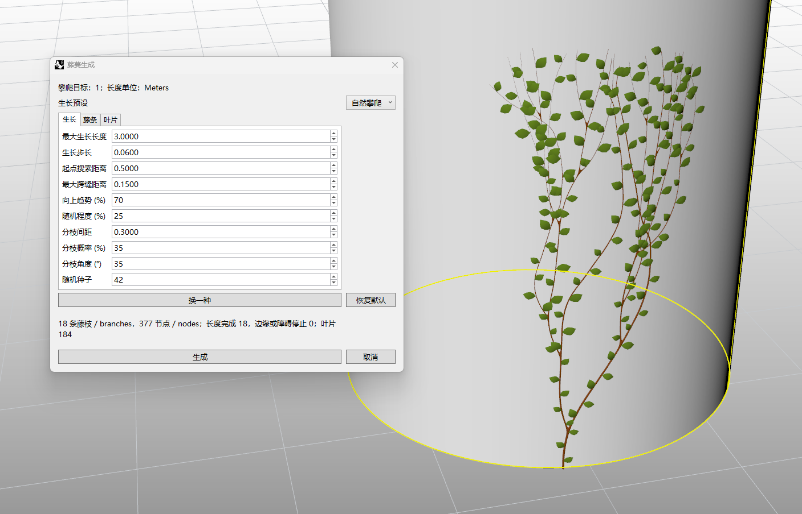

# rsIvy · Ivy Growth

> Module: Fun / Plant Generation

[← Back to command index](/en/commands/)

**Function**: Generate naturally climbing, branching ivy along selected objects as centerlines, SubD, or mesh stems, with optional separate leaf meshes. Results are grouped on the current layer.

*Natural Climber example: ivy grows upward from the base of a cylinder, branching along its surface with green leaves along the stems. The status area reports branches, nodes, stopping reasons, and leaf count.*

> Screenshots and videos may show a Chinese-language interface. Labels and control positions can vary by Rhino or RSTool version.

**Run**: Enter `rsIvy` in the Rhino command line (opens a settings window).

**Workflow**:

1. Enter rsIvy, select one or more climbing targets, and press Enter. Surfaces, polysurfaces, meshes, SubD, and extrusions are supported.
2. Pick a start point on or near a target, within the search distance and outside any closed target.
3. Choose a growth preset. Adjust length, direction, and branching on Growth, then thickness, surface gap, and output on Stems.
4. Set leaf generation, size, and spacing on Leaves. Inspect the live preview, or click New seed for another variation.
5. Once the preview is ready, click Create. Stems, leaves, and optional centerlines are grouped on the current layer; climbing targets remain.

**Parameters**:

### Growth tab: direction and density

Start with a preset, use length and upward bias to guide growth, then control coverage with branch spacing and probability. Panel lengths use the current document units. Values below are given in meters and automatically converted for other units.

| Display name | Parameter | Type | Default | Range | Description |
| --- | --- | --- | --- | --- | --- |
| Growth preset | Preset | option | Natural Climber | Natural Climber / Dense Green Wall / Sparse Climber / Broadleaf Vine / Spreading Vine / Custom | Switch growth styles while preserving maximum length, search distance, maximum gap, seed, and output options. Fine-tune the other settings afterward. |
| Maximum path length | MaxLength | number | 3 m | 0.01–1000 m; subject to document tolerance | Limits the path from the start to a growing tip, rather than vertical height or the sum of all branch lengths. |
| Step length | Step | number | 0.06 m | 0.001–10 m; ≤ maximum length | Distance advanced per growth step. Smaller steps add detail and nodes. Steps must accommodate the stem diameter, and search distance must be at least the step length. |
| Start search distance | SearchDistance | number | 0.5 m | 0.001–100 m; ≥ step length | Range for finding a target near the start. Move the start closer or increase this value if no target is found. |
| Maximum gap | MaxGap | number | 0.15 m | 0–10 m | Allowed unsupported span across a small gap. Zero disallows unsupported spans. Bridging also requires a reachable target nearby. |
| Upward bias | Upward | percentage | 70% | 0–100% | Adds a tendency toward world +Z along the surface. Higher values favor upward climbing; lower values allow more lateral spread. |
| Randomness | Randomness | percentage | 25% | 0–100% | Controls natural wandering. Higher values produce more winding paths. |
| Branch spacing | BranchSpacing | number | 0.3 m | 0.01–100 m; ≥ twice the step length | Distance traveled before attempting a branch. Branch probability decides whether each attempt succeeds. |
| Branch probability | BranchProbability | percentage | 35% | 0–100% | Chance of branching at each attempt. Combine higher values with shorter spacing for dense coverage; 0% produces no new branches. |
| Branch angle | BranchAngle | angle | 35° | 15–75° | Angle of a new branch relative to the current stem. Larger angles spread growth farther sideways. |
| Seed | Seed | integer | 42 | 0–2147483646 | The same targets, start, settings, and seed reproduce the same growth. New seed changes the seed. |

### Stems tab: thickness, surface gap, and output

Stems grow outside targets and check available space. Large diameters or gaps can prevent growth through narrow areas. Wait for the preview after adjusting settings and inspect contact areas.

| Display name | Parameter | Type | Default | Range | Description |
| --- | --- | --- | --- | --- | --- |
| Root diameter | RootDiameter | number | 0.015 m | > 8 × document tolerance and ≤ step length | Main stem diameter at the root, tapering toward tips and smaller branches. Thick stems may not fit narrow areas. |
| Tip diameter | TipRatio | percentage | 20% | 5–80% | Controls tip thickness relative to the root. Tip diameter must also exceed the minimum allowed by tolerance. |
| Minimum surface gap | Clearance | number | 0.003 m | ≥ 2 × document tolerance; panel maximum 1 m | Gap between the outside of the stem and the target. If smooth stems intersect a target, the command attempts to increase the gap and rebuild. |
| Mesh density | MeshDensity | integer | 2 | 1–3 | Controls stem mesh subdivision; higher values add faces. |
| Stem output | Output | option | Mesh | Centerlines / SubD / Mesh | Choose a lightweight skeleton, editable smooth SubD, or mesh. Centerline mode omits leaves. |
| Keep centerlines | KeepLines | toggle | Off | On / Off | Also keeps the ivy skeleton when outputting SubD or mesh geometry. |

### Leaves tab: size and spacing

Enable leaves for a complete plant, or turn them off for stems only. Leaves and stems are separate outputs for further editing.

| Display name | Parameter | Type | Default | Range | Description |
| --- | --- | --- | --- | --- | --- |
| Generate leaves | Leaves | toggle | On | On / Off | Adds leaves along the stems. Leaves are separate meshes even when stems use SubD output. |
| Leaf length | LeafLength | number | 0.08 m | 0.001–2 m; above the minimum size allowed by tolerance | Base leaf size, with slight random variation in individual leaves. |
| Leaf spacing | LeafSpacing | number | 0.12 m | 0.001–10 m; above the minimum size allowed by tolerance | Spacing along the stems. Smaller values give denser foliage; larger values make it sparser. |

**Notes**: New seed changes the random seed; Reset restores the initial Natural Climber settings. Default dimensions are converted to document units. For small models or coarse document tolerance, increase step length, stem diameter, and leaf dimensions as needed.

Growth may stop early at edges, obstacles, or areas with insufficient space. Use the status statistics to adjust the start, maximum gap, or settings. If smooth stems intersect targets, the command attempts to increase clearance and reports the adjusted gap. If generation still fails, try Centerlines output.

Generation is capped at 64 branches, 4096 nodes, and 2000 leaves, with a panel message when a limit is reached. Reduce branching density, increase step length, or increase leaf spacing to keep geometry lighter.
