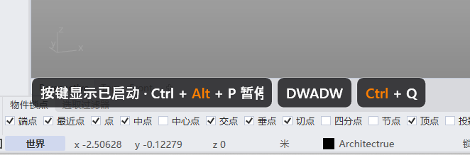

# rsKeyCast · Keystroke Display

> Module: Productivity / Screen Tools

[← Back to command index](/en/commands/)

**Function**: Start or stop the screen button display overlay

*Key display: The currently pressed Ctrl, Alt, P, D, W and other key combinations are displayed in real time on the screen floating layer*

> Screenshots and videos may show a Chinese-language interface. Labels and control positions can vary by Rhino or RSTool version.

**Run**: Enter `rsKeyCast` in the Rhino command line (command-line interaction).

**Workflow**:

1. Command line input rsKeyCast
2. Stop the session if it is already running
3. Otherwise start KeyCastSession
4. Show key overlay (Ctrl+Alt+P pause/resume)

**Parameters**:

> This command has no numeric command-line parameters. Adjust its options in the settings window.

**Notes**: Switching commands: run again to stop; Ctrl+Alt+P pause/resume; appearance controlled by rsKeyCastSettings
