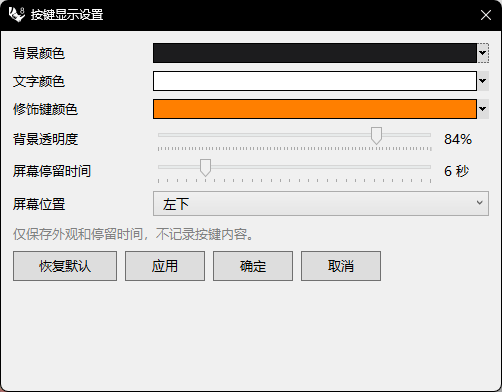

# rsKeyCastSettings · Keystroke Display Settings

> Module: Productivity / Screen Tools

[← Back to command index](/en/commands/)

**Function**: Configure and save key display appearance settings

*Button display settings: background color/text color/modifier key color/background transparency/screen dwell time/screen position + 4 buttons (restore default/apply/ok/cancel)*

> Screenshots and videos may show a Chinese-language interface. Labels and control positions can vary by Rhino or RSTool version.

**Run**: Enter `rsKeyCastSettings` in the Rhino command line (opens a settings window).

**Workflow**:

1. Command line input rsKeyCastSettings
2. Create and display the KeyCastSettingsForm (Eto) window
3. Adjust color/transparency/dwell time/position
4. Click Apply/OK to save to KeyCastSettingsStore and take effect.

**Parameters**:

| Display name | Parameter | Type | Default | Range | Description |
| --- | --- | --- | --- | --- | --- |
| background color | BackgroundColor | color | #1C1C1E |  | floating layer background color |
| text color | TextColor | color | #FFFFFF |  | Button text color |
| modifier key color | ModifierColor | color | #5DBCFF |  | Modifier key (Ctrl/Shift, etc.) color |
| background transparency | BackgroundOpacity | integer | 86 | 20-100 | Background opacity percentage, default 86 (0.86) |
| screen time | DisplayDurationSeconds | integer | 6 | 1-30 | The number of seconds the key prompt will stay, default 6 seconds |
| screen position | Position | list | BottomCenter | Top left / Top center / Top right / Left center / Screen center / Right center / Bottom left / Bottom center / Bottom right | Floating layer position, default bottom center (index 7) |

**Notes**: Eto dialog box; only saves appearance and dwell time, does not record key contents
