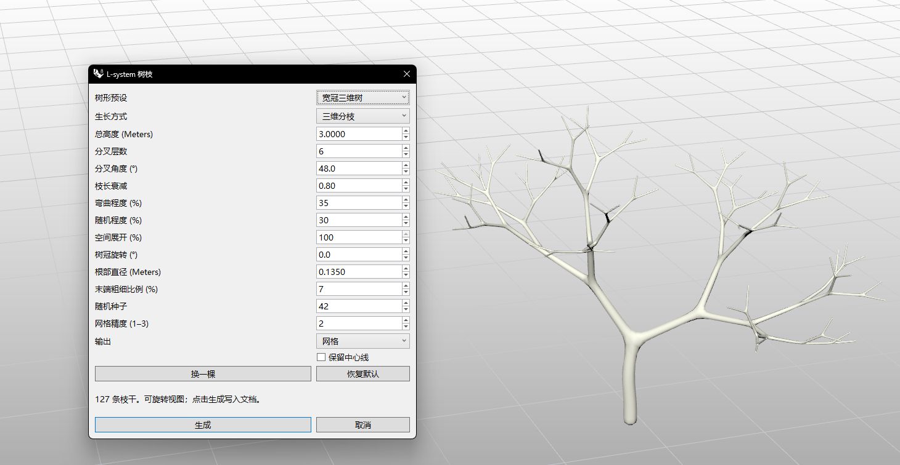

# rsLSystemTree · L-system Tree

> Module: Fun / Plant Generation

[← Back to command index](/en/commands/)

**Function**: Generate a naturally branching skeleton or smooth branches from a chosen root, as centerlines, SubD, or mesh. Results are grouped on the current layer.

*Broad 3D crown example: 3 m height, 6 branch levels, 48° angle, and 100% spatial spread create an open three-dimensional crown. Adjust the shape and output in the panel on the left.*

> Screenshots and videos may show a Chinese-language interface. Labels and control positions can vary by Rhino or RSTool version.

**Run**: Enter `rsLSystemTree` in the Rhino command line (opens a settings window).

**Workflow**:

1. Enter rsLSystemTree and pick the tree root in the viewport to open the settings panel.
2. Choose a preset close to the desired shape, then adjust height, branching, and branch thickness.
3. The viewport preview updates as settings change. Rotate the view to inspect the crown, or click New seed to try another branching pattern.
4. Choose Centerlines, SubD, or Mesh. Enable Keep centerlines if you want to edit the skeleton later.
5. Click Create to add grouped results to the current layer, or Cancel to discard the preview.

**Parameters**:

### Tree shape and branching

Start with the overall silhouette. Broad 3D crown is a useful starting point for a wide tree, while fan or planar presets suit elevation silhouettes and decorative branches. Defaults below refer to the initial fan preset.

| Display name | Parameter | Type | Default | Range | Description |
| --- | --- | --- | --- | --- | --- |
| Tree preset | Preset | option | Fan branches (reference) | Fan branches (reference) / Natural 3D tree / Broad 3D crown / Slender 3D tree / Planar branches / Custom | Apply a shape and fine-tune it. Preserves height, rotation, seed, and output settings. |
| Growth | Growth | option | Fan branching | Fan branching / 3D branching | Fan branching suits flatter shapes; 3D branching grows around the parent branch. Use Spatial spread to give the crown depth. |
| Height | Height | number | 3 m (converted to document units) | > 100 × document tolerance | Vertical height from the root to the highest branch tip. |
| Branch levels | Levels | integer | 5 | 1–8 | More levels add smaller terminal branches and substantially increase the amount of geometry. |
| Branch angle | Angle | angle | 30° | 5–65° | Larger angles give a wider crown; smaller angles create a slender, upright shape. |
| Length decay | LengthDecay | ratio | 0.72 | 0.45–0.90 | Controls how branch lengths decrease. Higher values keep outer branches longer; lower values shorten them faster. |

### Natural variation and orientation

Curvature and randomness shape the branches, while spatial spread controls crown depth. Keep the seed fixed when comparing individual adjustments.

| Display name | Parameter | Type | Default | Range | Description |
| --- | --- | --- | --- | --- | --- |
| Curvature | Curvature | percentage | 45% | 0–100% | Adds natural bending to otherwise straighter branches. |
| Randomness | Randomness | percentage | 25% | 0–100% | Varies branch lengths, angles, and directions to reduce regular symmetry. |
| Spatial spread | Spread | percentage | 15% | 0–100% | Controls crown depth. At 0% the shape is nearly planar; higher values add depth. |
| Rotation | Rotation | angle | 0° | -180–180° | Rotates the whole tree around the world vertical axis for placement or elevation views. |
| Random seed | Seed | integer | 42 | 0–2147483646 | The same settings and seed reproduce the same shape. New seed changes the seed. |

### Branch thickness and output

Branches with thickness have smooth junctions. Choose an output for your next step; the default mesh is suitable for typical scenes.

| Display name | Parameter | Type | Default | Range | Description |
| --- | --- | --- | --- | --- | --- |
| Root diameter | RootDiameter | number | 0.12 m (converted to document units) | > 4 × document tolerance and ≤ 30% of height | Sets trunk thickness at the root. Applying a preset resets this value in proportion to the current height. |
| Tip diameter | TipRatio | percentage | 8% | 2–50% | Controls tip thickness relative to the root. Tips must remain large enough for the document tolerance. |
| Mesh density | MeshDensity | integer | 2 | 1–3 | Controls final mesh subdivision. Higher density adds detail and faces; centerline output does not need this setting. |
| Output | Output | option | Mesh | Centerlines / SubD / Mesh | Use centerlines for further modeling, SubD for editing smooth branches, or mesh for scene placement. |
| Keep centerlines | KeepLines | toggle | Off | On / Off | Also outputs skeleton curves when creating SubD or mesh geometry. |

**Notes**: New seed changes only the random seed; Reset restores the initial settings. This command creates trunks and branches without leaves. The screenshot uses Broad 3D crown, so its values differ from the initial defaults.

More branch levels and higher mesh density increase geometry. Start with fewer levels to establish the silhouette, then add detail. If dimensions or tips are too small, check height, diameter, and document tolerance as prompted. If smooth geometry fails, use Centerlines to retain the skeleton.
