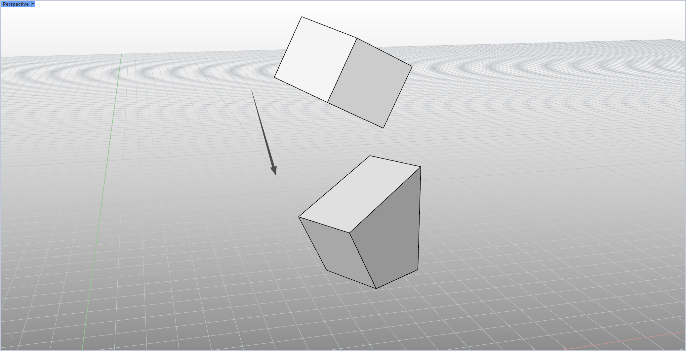

# rsLayFlat · Flatten with one click

> Module: Geometry / Object Transforms

[← Back to command index](/en/commands/)

**Function**: Flatten the object according to the specified face

*Figure 1: rsLayFlat flat lay effect. Rhino Perspective viewport (upper left corner Perspective Label, red and green coordinate axes in the lower left/lower right corner) There are two identical cube blocks: the upper one is a white + light gray square that is tilted in space (not in a horizontal posture), and the lower one is the same block that has been automatically calculated according to the target surface specified by the user. The support point and plane method are rotated backwards and flattened - the white top surface is horizontally upward, the gray front is vertically on the ground, and the whole is straight and horizontal; there is a black arrow in the middle of the viewport pointing downward from above, marking the process of "tilt → flat". The command flow is: Select the target surface on the object → Automatically calculate the support point and surface normal → Rotate and flatten the object to the surface*

> Screenshots and videos may show a Chinese-language interface. Labels and control positions can vary by Rhino or RSTool version.

**Run**: Enter `rsLayFlat` in the Rhino command line (command-line interaction).

**Workflow**:

1. Select the target face on the object
2. Automatic calculation of support points and surface normals
3. Rotate the object flat to this face

**Parameters**:

> This command has no numeric command-line parameters. Adjust its options in the settings window.

**Notes**: Reference objects, reference objects, and geometry within block definitions cannot be flattened.
