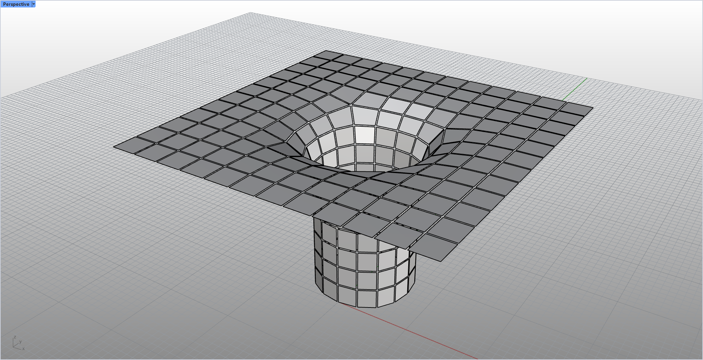

# rsMeshWindow · Mesh Toolkit

> Module: Geometry / Meshes

[← Back to command index](/en/commands/)

**Function**: Generate a reduced/retracted "window glass" topological mesh within each face of the original mesh, and hide the original mesh

*Rhino viewport: a "window glass" topological mesh generated within each face of the original mesh; a shrunken/zoomed fine pane structure (inner wireframe) is visible in each face, and the pane lines are thin and sparse*

*Comparative example of the same composition (the panes are significantly denser): the "window glass" topological mesh generated in each face of the original mesh is more detailed, and the number of visible pane lines in each row of the object area is significantly increased, corresponding to the effect when the Scale/Distance parameter takes a smaller zoom/indent value*

> Screenshots and videos may show a Chinese-language interface. Labels and control positions can vary by Rhino or RSTool version.

**Run**: Enter `rsMeshWindow` in the Rhino command line (command-line interaction).

**Workflow**:

1. Select the mesh to generate the window glass (Window)
2. Select the generation method: Scale (scaling according to proportion) or Distance (shrinking according to distance)
3. Input parameters (scaling ratio or shrinkage distance)
4. Generate Window topology mesh and hide the original mesh

**Parameters**:

| Display name | Parameter | Type | Default | Range | Description |
| --- | --- | --- | --- | --- | --- |
| Generation method | Mode | list | Scale | Scale / Distance | GetOption option; Scale=scale the side length proportionally, Distance=shrink according to the absolute distance |
| Zoom ratio | Scale ratio | double | 0.8 | 0.01–1.0 | Scale mode only; default 0.8 means the side length is reduced to 80% of its original size |
| inward distance | Inward distance | double | 1 | >=0.001 | Distance mode only; default 1.0 (model units) |
