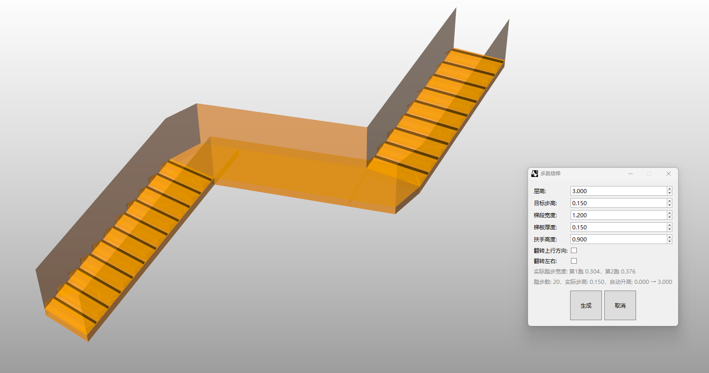

# rsMultiFlightStairs · Multi-Flight Staircase

> Module: Architecture / Stairs & Ramps

[← Back to command index](/en/commands/)

**Function**: Generate multiple stairs along the path (including landing, stair slabs and handrails, supporting flipping)

*Generate multi-run stairs after picking along the turning path point, automatically set the landing and ladder, support overall flipping and left-right flipping*

> Screenshots and videos may show a Chinese-language interface. Labels and control positions can vary by Rhino or RSTool version.

**Run**: Enter `rsMultiFlightStairs` in the Rhino command line (opens a settings window).

**Workflow**:

1. Pick the waypoint (define the direction of the multi-run stairs)
2. Set the floor height/step height/stair width/stair thickness/handrail height/flip in the dialog box
3. Real-time preview and generation of multi-run stairs (including landing and handrails)

**Parameters**:

| Display name | Parameter | Type | Default | Range | Description |
| --- | --- | --- | --- | --- | --- |
| Floor-to-floor height | FloorHeight | double | 3.0 | 0.01~10000 | Step 0.1, unit: meters |
| Riser height | StepHeight | double | 0.15 | 0.01~1000 | Step 0.01, unit: meters |
| Flight width | FlightWidth | double | 1.2 | 0.01~10000 | Step 0.1, unit: meters |
| Stair slab thickness | SlabThickness | double | 0.15 | 0.001~1000 | Step 0.01, unit: meters |
| Handrail height | HandrailHeight | double | 0.9 | 0~1000 | Step 0.1, unit: meters |
| flip | IsFlip | bool | false | true\|false | Whole flip |
| side flip | IsSideFlip | bool | false | true\|false | flip sideways |
