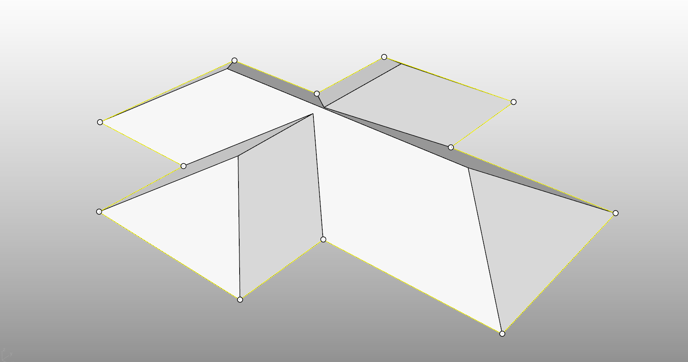

# rsOldTownRoof · Traditional Roof

> Module: Architecture / Building Elements

[← Back to command index](/en/commands/)

**Function**: Generating a sloping roof from a closed plane polyline (including hole sealing)

*Command line process: Pick one or more closed plane polylines as the roof outline → Enter the slope (degree) on the command line → Automatically generate a sloped roof along each polyline, and automatically seal holes and merge adjacent coplanar roofs*

> Screenshots and videos may show a Chinese-language interface. Labels and control positions can vary by Rhino or RSTool version.

**Run**: Enter `rsOldTownRoof` in the Rhino command line (command-line interaction).

**Workflow**:

1. Select closed plane polylines (can be multiple)
2. Enter slope in degrees
3. Generate a pitched roof (automatically seal holes/merge coplanar)

**Parameters**:

| Display name | Parameter | Type | Default | Range | Description |
| --- | --- | --- | --- | --- | --- |
| slope | SlopeAngle | double | 30.0 | 0.1~89.0 | Unit: degree |
