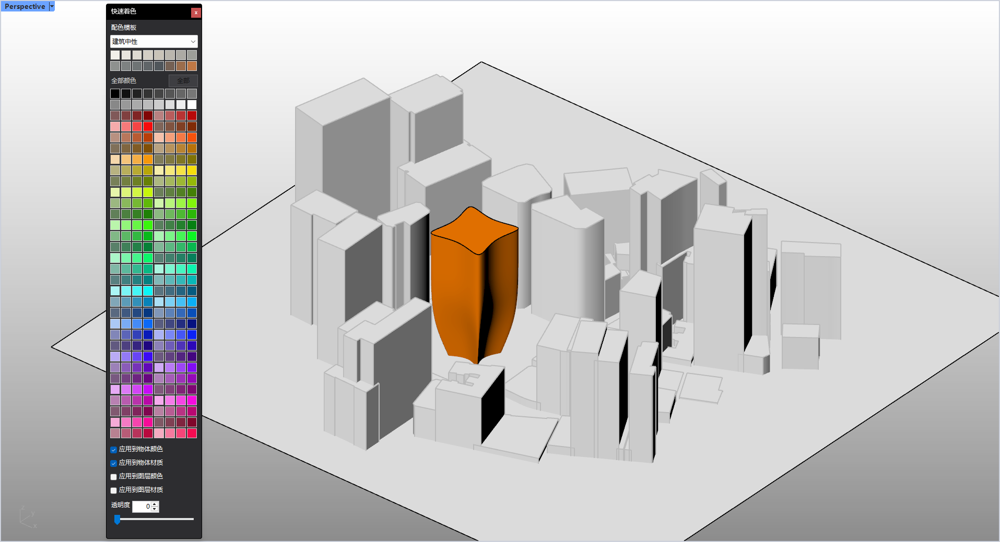

# rsQuickColor · Quick coloring

> Module: Organization & Selection / Material Tools

[← Back to command index](/en/commands/)

**Function**: Apply the selected color (including transparency) to the object color/material of the selected object or the color/material of the layer where it is located.

*Quick coloring window: Select/pick a color (including transparency) in the window, select the object (object color/material or layer color/material) and preview the scene effect instantly*

> Screenshots and videos may show a Chinese-language interface. Labels and control positions can vary by Rhino or RSTool version.

**Run**: Enter `rsQuickColor` in the Rhino command line (opens a settings window).

**Workflow**:

1. Command line input rsQuickColor
2. Select a color (palette/color template) in the quick coloring window
3. Check the application target (object color/object material/layer color/layer material)
4. After adjusting the transparency, click the color to apply it to the selected/selected objects

**Parameters**:

| Display name | Parameter | Type | Default | Range | Description |
| --- | --- | --- | --- | --- | --- |
| Apply to object color | ApplyObjectColor | toggle | true |  | Checked by default |
| Apply to object material | ApplyObjectMaterial | toggle | false |  |  |
| Apply to layer color | ApplyLayerColor | toggle | false |  |  |
| Apply to layer material | ApplyLayerMaterial | toggle | false |  |  |
| Transparency | Transparency | integer | 0 | 0 ~ 100 | TrackBar/NumericUpDown, 0=opaque, 100=fully transparent; internal storage is 0.0~1.0 |
| color matching template | ColorTemplate | list | architectural-neutral | 20 built-in templates | Drop down to select palette template |

**Notes**: WinForms window; if the object is not preselected, it will prompt for selection; settings are persisted to RsTool_QuickColor.json

**Tutorial videos**:

<iframe class="rstool-video" src="https://player.bilibili.com/player.html?isOutside=true&aid=116754642639698&bvid=BV1U6jN6MELo&cid=39143082515&p=1" scrolling="no" border="0" frameborder="no" framespacing="0" allowfullscreen="true" loading="lazy" title="RsTool ·Quick Color Demonstration Teaching (Bilibili)"></iframe>
*RsTool ·Quick Color Demonstration Teaching (Bilibili)*
