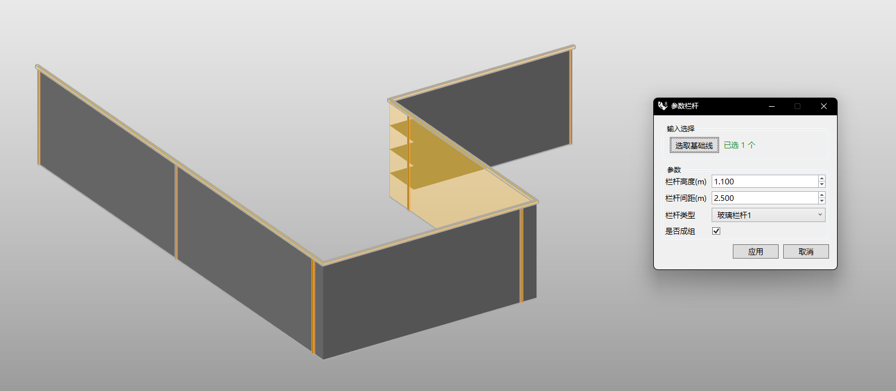

# rsRailing · Railing

> Module: Architecture / Building Elements

[← Back to command index](/en/commands/)

**Function**: Generate glass/handrails/columns/rails along the basic curve

*Eto "Parameter Railing" window: Select the basic railing curve and generate railings (including glass/handrails/posts/crossbars) along it. Adjust railing height, column spacing, railing type, and whether to be grouped in the window.*

> Screenshots and videos may show a Chinese-language interface. Labels and control positions can vary by Rhino or RSTool version.

**Run**: Enter `rsRailing` in the Rhino command line (opens a settings window).

**Workflow**:

1. Select base curve
2. Set railing height/spacing/type/grouping in parametric form
3. Generate railings (glass/handrails/posts/rails)

**Parameters**:

| Display name | Parameter | Type | Default | Range | Description |
| --- | --- | --- | --- | --- | --- |
| railing height | RailingHeight | double | 1.1 | 0.001~10000 | Step 0.1, unit: meters |
| Railing spacing | RailingSpacing | double | 2.5 | 0.001~10000 | Step 0.1, unit: meters |
| railing type | RailingType | list | 0 | Glass railing 1 \| Grid railing 1 \| Horizontal mesh railing \| Glass railing 2 \| Grid railing 2 | 0~4 |
| Is it a group? | IsGrouped | bool | false | true\|false | Group the generated results |
