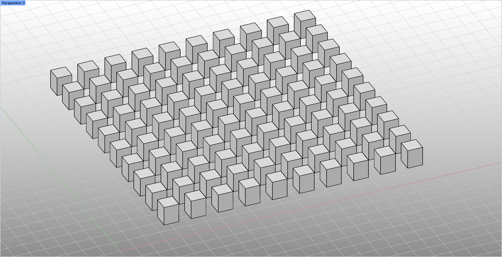
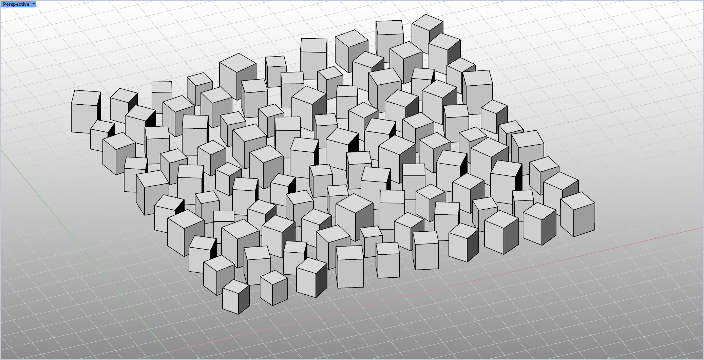

# rsRandomChange · Random Transform

> Module: Geometry / Object Transforms

[← Back to command index](/en/commands/)

**Function**: Apply random rotation angle and random scaling to each selected object (modify in place, retain history)

*Figure 1: rsRandomChange before operation. The Rhino Perspective viewport (Perspective label in the upper left corner, red and green coordinate axes in the lower left/lower right corner) is a neatly arranged array of cubic cubes: about 13 columns × 10 rows, a total of 130 small white squares, arranged equidistantly along the ground grid, each block has the same size and posture (the edges are aligned with the XYZ axis), without any random disturbance - this is the input reference state of the rsRandomChange command*

*Figure 2: After rsRandomChange operation. The same array of about 130 cubic blocks, each block has been given an independent random rotation angle (based on the lower center of each object's bounding box, rotating in place) and a random scaling ratio (default 0.8-1.2 (retain two decimal places): The overall size of the blocks is different, the postures are different, and the top faces are also oriented in different directions. Some blocks are displaced closer to each other, and some are sparser. The original regular and rigid array of blocks is broken, showing an organic sense of randomness; each object is modified on the spot and historical records are retained.*

> Screenshots and videos may show a Chinese-language interface. Labels and control positions can vary by Rhino or RSTool version.

**Run**: Enter `rsRandomChange` in the Rhino command line (command-line interaction).

**Workflow**:

1. Command line input rsRandomChange
2. Select the object to be randomly modified (GetMultiple, multiple selections possible)
3. Use options to set angle range, minimum zoom, and maximum zoom during selection
4. After entering, apply random rotation and random scaling to each object.

**Parameters**:

| Display name | Parameter | Type | Default | Range | Description |
| --- | --- | --- | --- | --- | --- |
| Angle range | AngleRange | double | 180 | >=0 | The upper limit of random rotation angle (degrees), actual rotation = PI*(angle/180)*rand (lastAngleRangeNum memory, default 180) |
| Minimum zoom value | MinimumScale | double | 0.8 | >=0.01 | Random scaling lower limit (lastMinScaleNum memory) |
| Maximum zoom value | MaximumScale | double | 1.2 | >=0.01 | Random scaling upper limit (lastMaxScaleNum memory) |

**Notes**: Random rotation is based on the lower center of each object's bounding box; scaling is kept to two decimal places.
