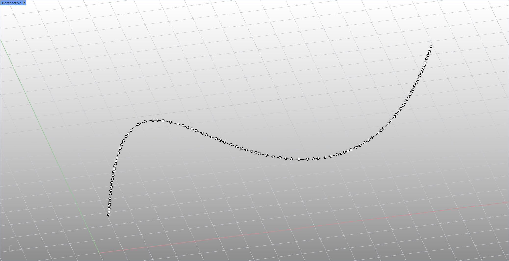

# rsRandomPtsOnCrv · Random point on curve

> Module: Geometry / Points

[← Back to command index](/en/commands/)

**Function**: Generates a specified number of random points with a specified distribution pattern on the selected curve (removing too close points)

*Figure 1: Example of rsRandomPtsOnCrv effect. There is an S-shaped/wavy input curve in the Rhino Perspective viewport (Perspective label in the upper left corner, red and green coordinate axes in the lower left/lower right corner). A large number of small circle points are randomly distributed along the curve (each point = one sampling point on the curve). The density of the points is controlled by the command parameters (number/minimum spacing, etc.). The positions of the points strictly fall on the input curve, but the distribution is random and will not be evenly spaced like equidistant points.*

> Screenshots and videos may show a Chinese-language interface. Labels and control positions can vary by Rhino or RSTool version.

**Run**: Enter `rsRandomPtsOnCrv` in the Rhino command line (command-line interaction).

**Workflow**:

1. Command line input rsRandomPtsOnCrv
2. Select the target curve (Curve, GetObject, multiple selections available)
3. Use option to switch distribution mode during selection (completely random / as even as possible)
4. Enter the number of random points (GetInteger, default 100)
5. Set the tolerance for deleting close points (GetNumber, default 0.5)
6. Generate random points on the curve and remove too close points before writing to the document

**Parameters**:

| Display name | Parameter | Type | Default | Range | Description |
| --- | --- | --- | --- | --- | --- |
| distribution pattern | DistributionMode | toggle | Try to be as even as possible (EvenRandom) | Completely random (TrueRandom) / as even as possible (EvenRandom) | Switch the random sampling strategy; try to use the candidate point method (Poisson type) to spread the distance evenly |
| Number of random points | Count | integer | 100 | >=1 | Generate random number of points (lastRandomPtNum memory, default 100) |
| Approach point tolerance | RemoveTolerance | double | 0.5 |  | Remove the tolerance of duplicate points whose distance is smaller than this value (lastDelTolNum memory, default 0.5) |

**Notes**: No explicit lower bound constraint; multiple curves allocate samples weighted by length.
