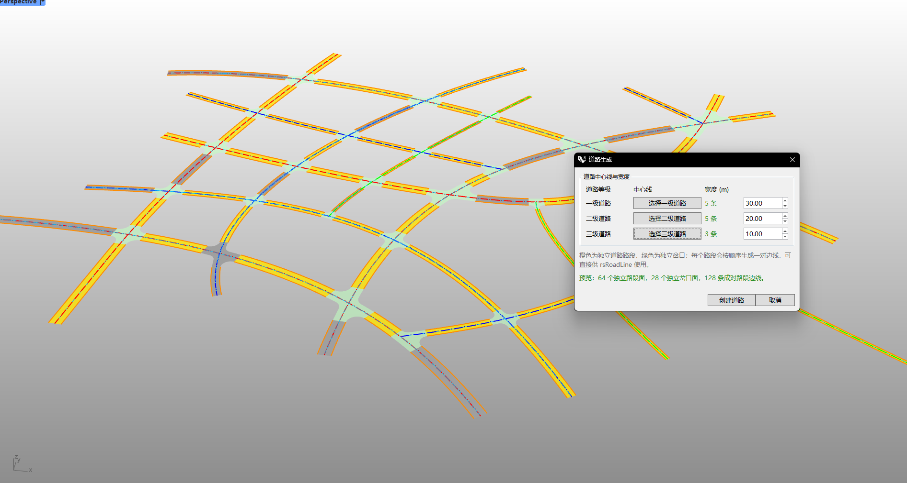

# rsRoadGenerator · Road Generator

> Module: Architecture / Roads

[← Back to command index](/en/commands/)

**Function**: Multi-level road surfaces, intersection surfaces and road segment edges are generated from the center lines of roads at all levels.

*Road generation effect: multi-level road network (level 30m / level 2 20m / level 3 10m), including fork surfaces and edges*

> Screenshots and videos may show a Chinese-language interface. Labels and control positions can vary by Rhino or RSTool version.

**Run**: Enter `rsRoadGenerator` in the Rhino command line (opens a settings window).

**Workflow**:

1. Open the road generation dialog
2. Pick center lines separately for primary/secondary/tertiary roads
3. Set road width at each level
4. Preview and generate road surfaces, intersection surfaces and edges in real time

**Parameters**:

| Display name | Parameter | Type | Default | Range | Description |
| --- | --- | --- | --- | --- | --- |
| First class road width | FirstLevelWidth | double | 30 | >0 (min max(0.01, tol*4)) | Unit: meter, step 0.5 |
| Secondary road width | SecondLevelWidth | double | 20 | >0 | Unit: meter |
| Third grade road width | ThirdLevelWidth | double | 10 | >0 | Unit: meter |

**Notes**: The center lines of each level can be picked separately in the dialog box.
