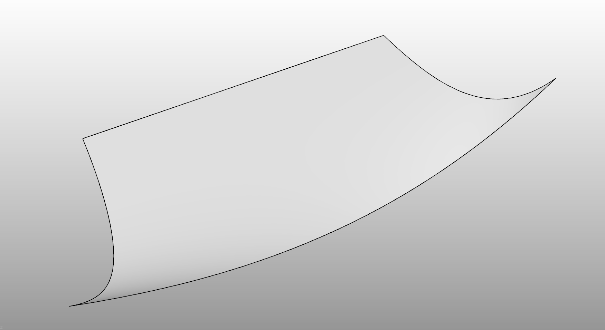
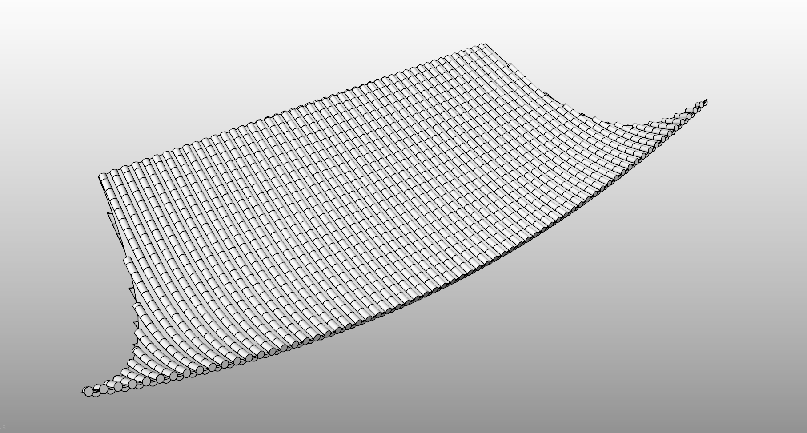

# rsRoofTile · Roof tile generation

> Module: Architecture / Building Elements

[← Back to command index](/en/commands/)

**Function**: Generate tiles along the base surface and path line array (tile type/spacing adjustable)

*Command line process (step 1): Pick a piece of roof surface as the base surface for tile attachment; shown in the figure is the outline of the base surface when the reference curve has not been selected*

*Command line process (step 2-4): Pick the reference curve (tile arrangement path) → Set the tile type and tile spacing on the command line → Generate tiles along the basic surface and path line array, supporting adjustable tile type and spacing*

> Screenshots and videos may show a Chinese-language interface. Labels and control positions can vary by Rhino or RSTool version.

**Run**: Enter `rsRoofTile` in the Rhino command line (command-line interaction).

**Workflow**:

1. Select roof surface
2. Select the reference curve (tile arrangement path)
3. Set tile type and tile spacing
4. Generate tile array

**Parameters**:

| Display name | Parameter | Type | Default | Range | Description |
| --- | --- | --- | --- | --- | --- |
| Tile type | TileType | list | 0 | Tube tiles \| Flat tiles \| Roman tiles \| Fish scale tiles | 0=PanAndCover, 1=Flat, 2=Roman, 3=FishScale |
| Tile spacing | TileSpacing | double | 0.2 | >0 (min ~0) | Unit: meter |
