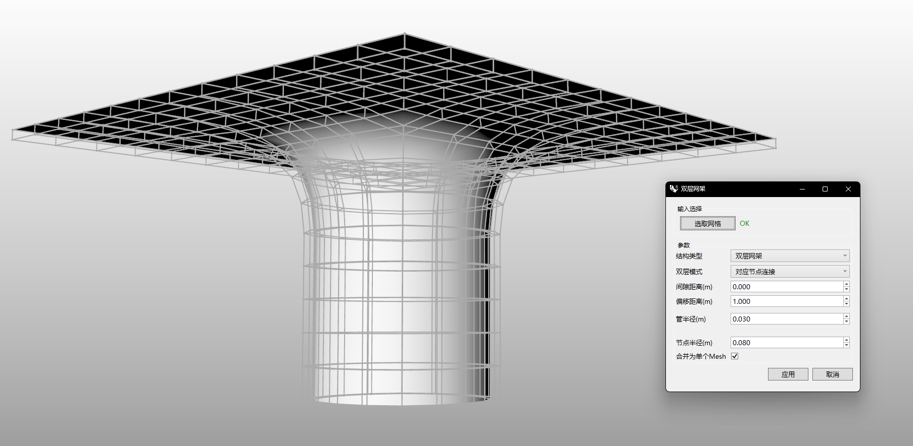

# rsSpaceTruss · Double-Layer Space Frame

> Module: Architecture / Building Elements

[← Back to command index](/en/commands/)

**Function**: Generate single/double-layer space grid (rods and nodes) based on basic Mesh

*Eto "Double-layer grid" window: After selecting the basic Mesh, set the structure type (single-layer/double-layer), double-layer mode (corresponding node connection/face inclined rod + Dual upper chord), gap distance, offset distance, tube radius, node radius, and support merging into a single Mesh, real-time preview and generation of grid (rods and nodes)*

> Screenshots and videos may show a Chinese-language interface. Labels and control positions can vary by Rhino or RSTool version.

**Run**: Enter `rsSpaceTruss` in the Rhino command line (opens a settings window).

**Workflow**:

1. Open the parameterized grid form
2. Select basic mesh
3. Set structure type/mode/members/nodes and dimensions
4. Real-time preview and generation of grid (single or double layer)

**Parameters**:

| Display name | Parameter | Type | Default | Range | Description |
| --- | --- | --- | --- | --- | --- |
| Structure type | StructureType | list | 1 | Single layer grid\|Double layer grid | 0=Single Layer, 1=Double Layer |
| Two-layer mode | Mode | list | 0 | Corresponding node connection\|face inclined rod+Dual upper chord | Only available in double layers; 0=Corresponding Nodes, 1=Face Diagonals+Dual Top |
| single layer rod | MemberType | list | 0 | Round tube\|Square tube | Only available in single layer; 0=Round Pipe, 1=Square Tube |
| Square tube node | NodeType | list | 0 | Spherical node\|Cylinder node | Available only for single-layer square tubes; 0=Sphere, 1=Cylinder |
| gap distance | GapDistance | double | 0 | Any (including negative values) | Unit: meter |
| offset distance | OffsetDistance | double | 1.0 | Any (including negative values) | Unit: meter |
| tube radius | PipeRadius | double | 0.03 | >0 (min 0.001) | Unit: meter |
| Square tube width | SquareTubeWidth | double | 0.06 | >0 (min 0.001) | Unit: meter |
| Square tube height | SquareTubeHeight | double | 0.08 | >0 (min 0.001) | Unit: meter |
| node radius | NodeRadius | double | 0.08 | >0 (min 0.001) | Unit: meter |
| Merge into a single Mesh | JoinResult | bool | false | true\|false | Combine results into a single Mesh |

**Notes**: Parameter visibility is linked to structure type and member type
