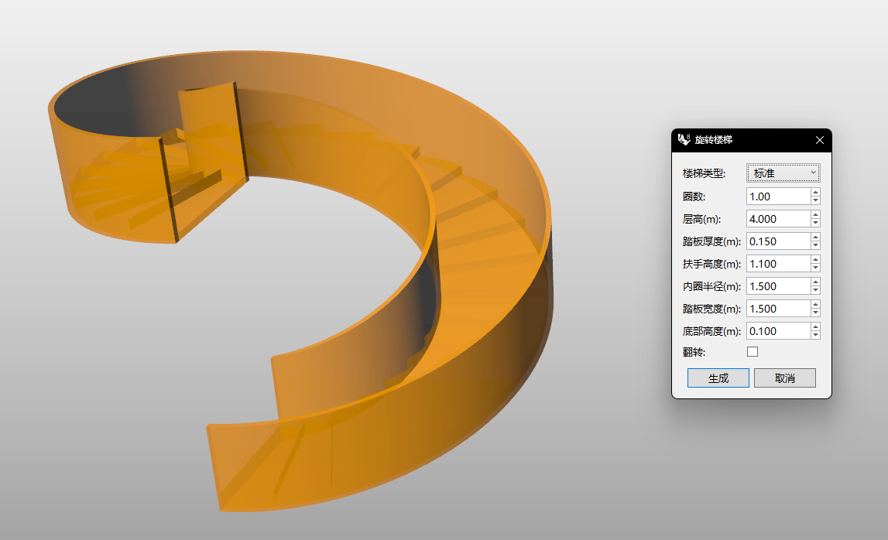

# rsSpiralStair · Spiral Staircase

> Module: Architecture / Stairs & Ramps

[← Back to command index](/en/commands/)

**Function**: Spiral staircase (including handrails, standard or hollow steps)

*Select the base point of the spiral staircase to generate a spiral staircase. It supports two tread types: standard/hollow. The number of turns/radius/tread width, etc. are adjustable.*

> Screenshots and videos may show a Chinese-language interface. Labels and control positions can vary by Rhino or RSTool version.

**Run**: Enter `rsSpiralStair` in the Rhino command line (opens a settings window).

**Workflow**:

1. Select the base point of the spiral staircase
2. Set parameters in dialog box
3. Real-time preview and generation of spiral stairs (including handrails)

**Parameters**:

| Display name | Parameter | Type | Default | Range | Description |
| --- | --- | --- | --- | --- | --- |
| Number of turns | TurnCount | double | 1 | 0.01~1000 | Step 0.01 |
| Floor-to-floor height | FloorHeight | double | 4 | 0.01~10000 | Step 0.1, unit: meters |
| Tread thickness | StepHeight | double | 0.15 | 0.001~1000 | Step 0.01, unit: meters |
| Handrail height | HandrailHeight | double | 1.1 | 0.01~1000 | Step 0.1, unit: meters |
| Inner radius | InnerRadius | double | 1.5 | 0.01~10000 | Step 0.1, unit: meters |
| Tread width | StepWidth | double | 1.5 | 0.01~10000 | Step 0.1, unit: meters |
| Bottom height | BottomHeight | double | 0.1 | 0~10000 | Step 0.1, unit: meters |
| flip | IsFlip | bool | false | true\|false | Flip the direction of the stairs |
| Stair type | Type | list | 0 | Standard \| Empty tread | 0=standard, 1=hollow tread |
