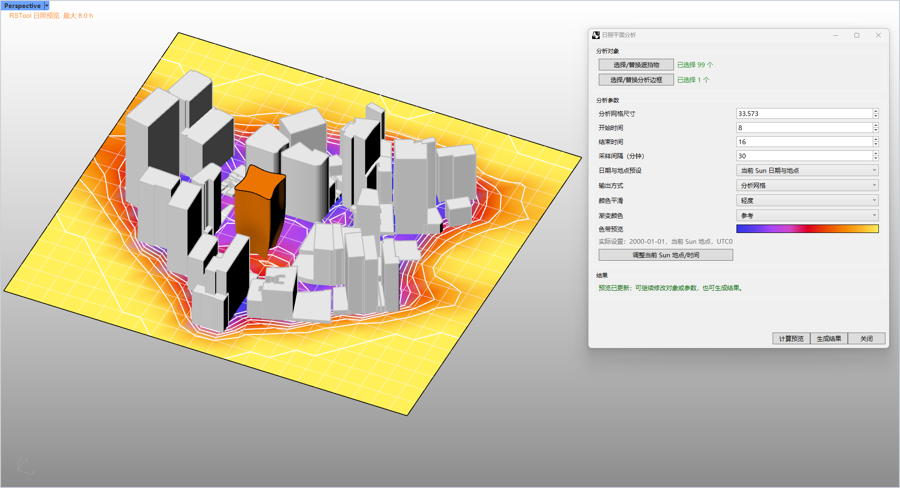

# rsSunlightAnalysisByGrid · Planar Sunlight Analysis

> Module: Analysis / Building Performance Analysis

[← Back to command index](/en/commands/)

**Function**: Sunshine hours at each grid point (text label or vertex shaded grid + legend)

*Sunshine plane analysis: The colored grid displays the sunshine hours at each point (purple→yellow gradient + legend), and the Eto setting dialog box is on the right*

> Screenshots and videos may show a Chinese-language interface. Labels and control positions can vary by Rhino or RSTool version.

**Run**: Enter `rsSunlightAnalysisByGrid` in the Rhino command line (opens a settings window).

**Workflow**:

1. Make sure Document Sun is enabled (it will be enabled automatically if not enabled)
2. Select obstruction/building (Brep/Mesh, multiple selections possible)
3. Select the analysis range (a closed rectangular curve/polyline)
4. Set the grid size, start and end hours, step size, output method and color in the Eto dialog box
5. After confirmation, calculate the sunshine hours point by point according to the grid, and output text labels or colored grids

**Parameters**:

| Display name | Parameter | Type | Default | Range | Description |
| --- | --- | --- | --- | --- | --- |
| Grid size | gridSize | double | min (wide range, high range)/20 | >0 (in model units) | Analyze the side length of the grid unit; the first default is 1/20 of the short side of the range, and then the last value _lastGridSize is used. |
| start hour | startHour | integer | 8 | 0 – 23 | Sunshine analysis start time |
| end hour | endHour | integer | 16 | 0 – 23, and ≥ start hour | Rizhao analysis end time |
| time step | stepMinutes | integer | 30 | 1 – 120 | Sampling interval (minutes); static default _lastStepMinutes=30 |
| Output mode | output | list | Text | Text / Mesh | Text=Output text label of sunshine hours at each grid point; Mesh=Output colored grid |
| smooth result | smoothingIterations | list | Light | NoSmooth=0 / Light=1 / Medium=3 | Only effective when Mesh output |
| gradient color | colorScheme | list | 0 | SunlightColorSchemes scheme list | Shared sunshine color scheme, index 0 by default |

**Notes**: Depends on document Sun's latitude/longitude/date; analysis range must be a closed rectangular curve.
