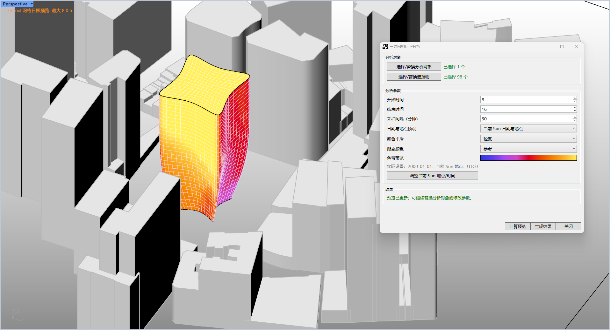

# rsSunlightAnalysisByMesh · 3D Mesh Sunlight Analysis

> Module: Analysis / Building Performance Analysis

[← Back to command index](/en/commands/)

**Function**: Vertex color and analysis mesh with daylight hours + legend

*Three-dimensional mesh sunshine analysis: The analysis mesh writes the vertex color (purple→pink→yellow gradient) according to the sunshine hours. The Eto setting dialog box on the right*

> Screenshots and videos may show a Chinese-language interface. Labels and control positions can vary by Rhino or RSTool version.

**Run**: Enter `rsSunlightAnalysisByMesh` in the Rhino command line (command-line interaction).

**Workflow**:

1. Make sure Document Sun is enabled
2. Select analysis mesh (Mesh, command line picking)
3. Select occlusion (optional, Mesh/Brep, command line picking)
4. The Eto dialog box pops up to set the start and end hours, step size, smoothing and color matching.
5. After confirmation, calculate the sunshine hours face by face/vertex by vertex and write the vertex color, with legend.

**Parameters**:

| Display name | Parameter | Type | Default | Range | Description |
| --- | --- | --- | --- | --- | --- |
| start hour | StartHour | integer | 8 | 0 – 23 | Sunshine analysis start time |
| end hour | EndHour | integer | 16 | 0 – 23, and ≥ start hour | Rizhao analysis end time |
| time step | StepMinutes | integer | 30 | 1 – 120 | Sampling interval (minutes); static default _lastStepMinutes=30 |
| smooth result | SmoothingIterations | list | Light | NoSmooth=0 / Light=1 / Medium=3 | Mesh vertex color smoothing intensity |
| gradient color | ColorSchemeIndex | list | 0 | SunlightColorSchemes scheme list | Shared sunshine color scheme, index 0 by default |

**Notes**: Depends on document Sun's date and latitude and longitude; obscuration is optional.
