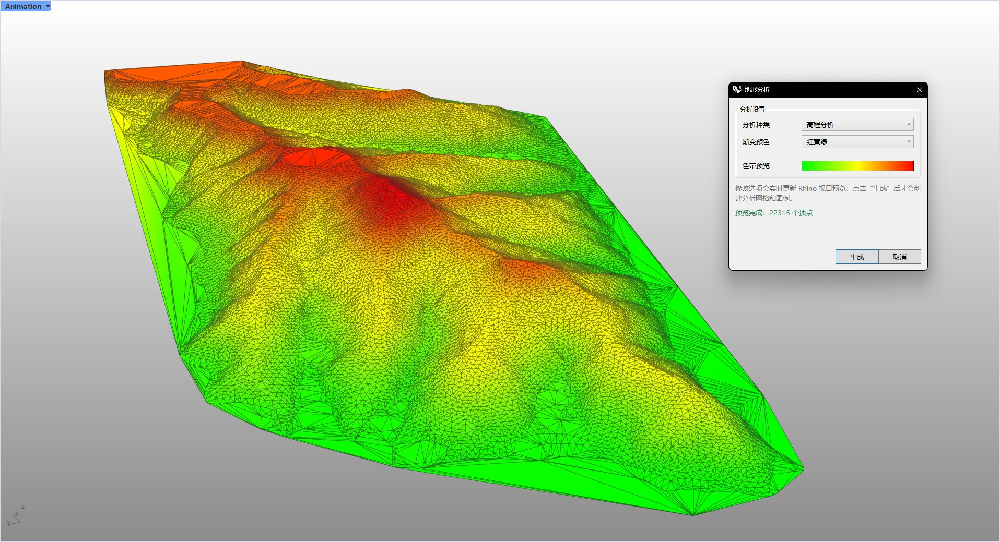

# rsTerrainAnalysis · Terrain analysis

> Module: Terrain / Analysis & Simulation

[← Back to command index](/en/commands/)

**Function**: Terrain mesh colored by selected analysis type and accompanied by numerical legend

*Eto terrain analysis window: Select the analysis type (elevation/aspect/slope/concave/roughness/water accumulation risk/buildability/terrain curvature/confluence/erosion risk/building orientation suitability), gradient color and hemispheric orientation, and preview the color band in real time on the right; after confirmation, a terrain grid colored according to the selected type is generated with a numerical legend.*

> Screenshots and videos may show a Chinese-language interface. Labels and control positions can vary by Rhino or RSTool version.

**Run**: Enter `rsTerrainAnalysis` in the Rhino command line (opens a settings window).

**Workflow**:

1. Select the terrain object to analyze (Mesh or Surface Brep)
2. If you select a surface, enter the precision reference value for Brep to mesh.
3. Select the analysis type, gradient color and hemisphere orientation in the Eto dialog box, and preview it in real time
4. After confirmation, a shaded grid is generated with a legend

**Parameters**:

| Display name | Parameter | Type | Default | Range | Description |
| --- | --- | --- | --- | --- | --- |
| Grid transfer accuracy | meshPrecision | double | 1.0 | >0 (scaled by model units) | Prompt for input only if input is Brep/Surface; static default _lastMeshPrecision=1.0 |
| Analysis type | AnalysisType | list | Elevation | Elevation / Aspect / Slope / Concavity / Roughness / PondingRisk / Buildability / TerrainCurvature / FlowAccumulation / ErosionRisk / BuildingOrientation | Chinese tags: elevation/aspect/slope/concavity/roughness/water accumulation risk/buildability/terrain curvature/catchment/erosion risk/suitability of building orientation |
| gradient color | ColorScheme | list | RedYellowGreen | RedYellowGreen / GreenGradient / OrangeYellowBlue / Grayscale / CustomGradient | Custom gradient can set starting and ending colors |
| hemisphere orientation | Hemisphere | list | 0 | 0 / 1 / 2 | Specify the reference hemisphere (north/south/east, etc.) for aspect/sunlight related analysis |

**Notes**: The analysis results are written to a new mesh in the form of vertex colors, and a legend is automatically generated.
