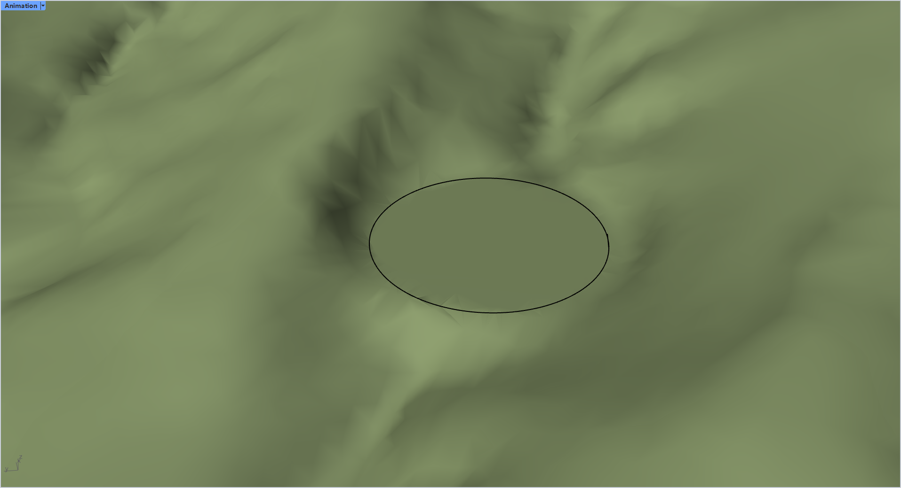

# rsTerrainEdit · Edit terrain

> Module: Terrain / Acquisition & Editing

[← Back to command index](/en/commands/)

**Function**: Modified terrain mesh (dug or leveled)

*CutAndFill mode: The elliptical area is cut and filled at a specified angle to form a horizontal plane.*

> Screenshots and videos may show a Chinese-language interface. Labels and control positions can vary by Rhino or RSTool version.

**Run**: Enter `rsTerrainEdit` in the Rhino command line (command-line interaction).

**Workflow**:

1. Select the terrain mesh to edit
2. Select one or more closed boundary curves (for burrowing or cut-and-fill)
3. Switch modes and adjust parameters in the command line options, and generate a new terrain mesh after confirmation.

**Parameters**:

| Display name | Parameter | Type | Default | Range | Description |
| --- | --- | --- | --- | --- | --- |
| Processing method | Mode | list | Hole | Hole / CutAndFill | Hole=dig a hole in the terrain; CutAndFill=cut and fill at an angle (the site is flat) |
| Digging depth | HoleDepth | double | 0.0 |  | Only valid in Hole mode, the sinking depth of the hole bottom relative to the original terrain |
| cut and fill angle | CutAndFillAngle | double | 45.0 |  | Only valid in CutAndFill mode, slope angle (degrees) |

**Notes**: The boundary curve must be a closed curve, otherwise the clipping area cannot be calculated correctly.
