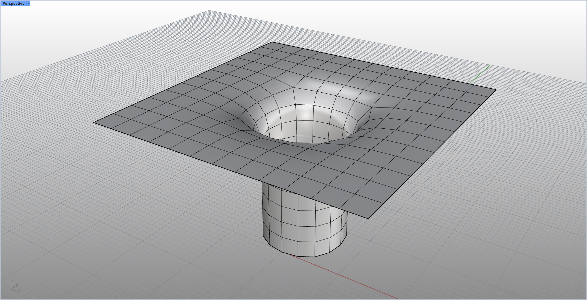
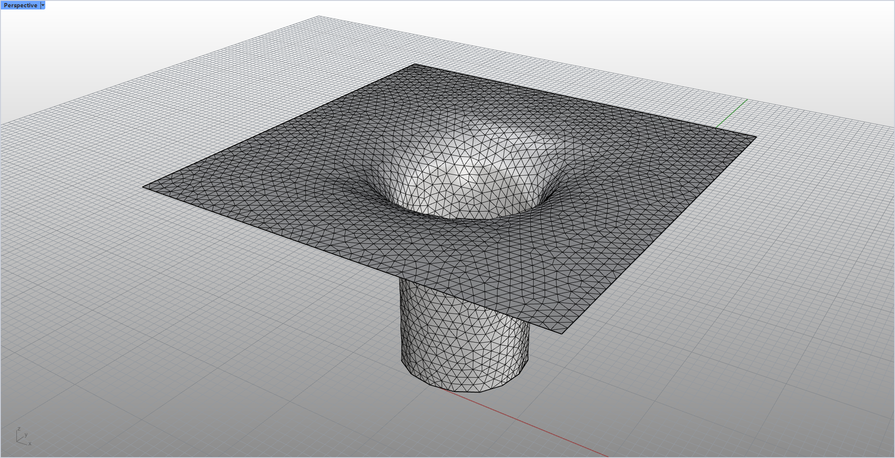

# rsTriRemesh · Triangle Remesh

> Module: Geometry / Meshes

[← Back to command index](/en/commands/)

**Function**: Uniform triangular mesh (isotropic retopology)

*Original mesh (Before): solid mesh surface with continuous surface and only visible thin edges, used as the input object of isotropic regridding*

*Isotropic triangle re-meshing result (After): The original mesh surface is redrawn into homogeneous triangles of similar size (each side length is close, and the degree of each vertex is close to 6); compared with the original mesh, the line density is increased by about 55%, the proportion of dark black pixels increases from 0.4% to 2.2%, and the darkest value of the picture is reduced from 66 to 32 - dense triangle surfaces cast deeper shadows in low-lying areas and corners.*

> Screenshots and videos may show a Chinese-language interface. Labels and control positions can vary by Rhino or RSTool version.

**Run**: Enter `rsTriRemesh` in the Rhino command line (command-line interaction).

**Workflow**:

1. Select mesh
2. Enter the target side length (default is automatically estimated based on the diagonal of the bounding box/20)
3. Enter the number of iterations
4. Perform isotropic triangular reconstruction

**Parameters**:

| Display name | Parameter | Type | Default | Range | Description |
| --- | --- | --- | --- | --- | --- |
| Target side length | Target edge length | double | auto = bbox.Diagonal/20 | >=0.0001 | Isotropic remeshing target side length; automatic default = 1/20 of bounding box diagonal length |
| Number of iterations | Iterations | integer | 5 | 1–20 |  |

**Notes**: Based on Botsch & Kobbelt isotropic remeshing algorithm
