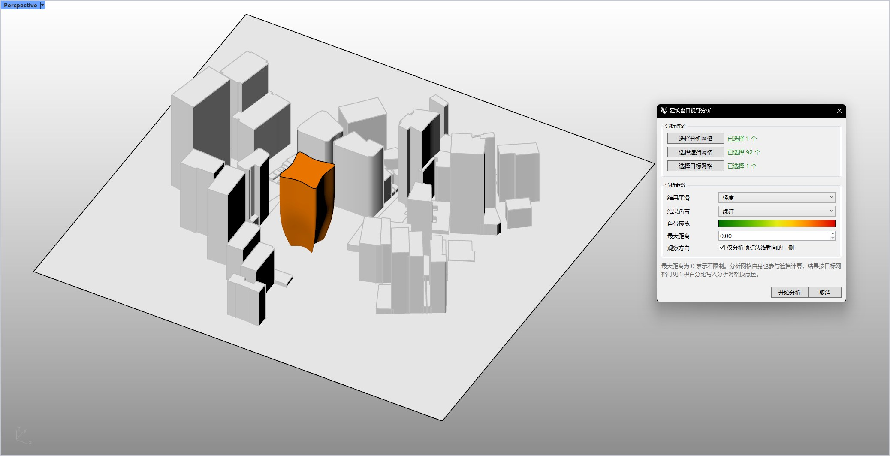
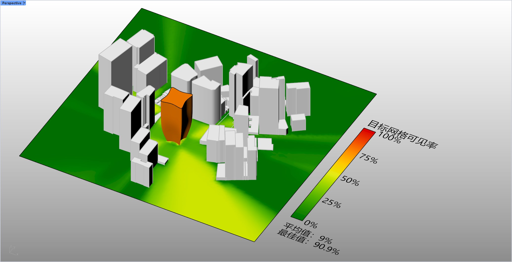

# rsViewshedAnalysis · Viewshed Analysis

> Module: Analysis / Building Performance Analysis

[← Back to command index](/en/commands/)

**Function**: Write the target visibility rate (0~1) coloring result on the vertex color of the analysis mesh, and generate a color legend (including average visibility rate and best visibility rate text)

*Figure 1: View Distance Window Raster Analysis Settings dialog box. After entering rsViewshedAnalysis in the command line, the [View Distance Window Grid Analysis] window pops up. The upper part of the [Analysis Object] requires the selection of three types of grids in sequence: [Select Analysis Grid] (1 has been selected in this example, street surface), [Select Occlusion Grid] (92 have been selected, the entire surrounding buildings participate in the occlusion determination), [Select Target Grid] (1 has been selected) , the highlighted surface in the center is the target building); the [Analysis Parameters] in the lower half can be set: result smoothing (light), result color band (green-red gradient, with color band preview), maximum distance (0.00, no limit), observation direction (check [Only analyze the side with the normal line of the top surface facing downward] to eliminate the back side); click [Start Analysis] to trigger the parallel calculation of MeshRay rays, click [Cancel] to give up this analysis.*

*Figure 2: Thermal coloring and legend of analysis results. After the calculation is completed, the command writes the target visibility rate (0~1) of each analysis grid vertex into the vertex color in a green-yellow-red gradient, and automatically generates a legend in the lower right corner: In this example, the legend ruler [target grid visibility rate] 0% / 25% / 50% / 75% / 100%, bottom statistics [average 9%], [optimal value 90.9%]; visible about 30 meters directly in front of the target building The ground within a meter range is painted as a yellow high-visibility area, which is the best location for planning the main entrance and advertising space; the large green low-visibility area immediately behind the adjacent tower shows that the area is easily blocked and should be used as a logistics channel rather than a main image display surface.*

> Screenshots and videos may show a Chinese-language interface. Labels and control positions can vary by Rhino or RSTool version.

**Run**: Enter `rsViewshedAnalysis` in the Rhino command line (opens a settings window).

**Workflow**:

1. Command line input rsViewshedAnalysis
2. In the pop-up "Building Window View Analysis" dialog box, click "Select Analysis Grid" and pick a grid as the analysis object.
3. Click "Select Occlusion Grid" (optional) to pick the occlusion grid; click "Select Target Grid" to pick one or more target grids.
4. Set parameters such as result smoothing/result color band/maximum distance/observation direction
5. Click "Start Analysis" and wait for the ray parallel calculation to complete
6. The results are written into the analysis grid vertex color according to the target grid visibility rate, and a color legend (including average/optimal visibility rate) is automatically generated.

**Parameters**:

| Display name | Parameter | Type | Default | Range | Description |
| --- | --- | --- | --- | --- | --- |
| smooth result | SmoothingIterations | list | Mild(1) | Unsmooth(0) / Mild(1) / Moderate(3) | Iteration gear for neighborhood smoothing on vertex color results |
| Result Ribbon | ColorSchemeIndex | list | 5 | Comes with the system color band list (SunlightColorSchemes) | Gradient scheme index for mapping visibility to color |
| maximum distance | MaxDistance | double | 0 (no limit) | 0 ~ 100000000 | The maximum distance of the ray; 0 means no distance limit |
| viewing direction | FrontDirectionOnly | toggle | true | on/off | Only count targets with vertex normals facing one side (removing the back side) |

**Notes**: The analysis grid itself also participates in occlusion calculation; target visibility rate = visible target area / total target area; parallel calculation based on MeshRay ray intersection. A maximum distance of 0 means no limit.
