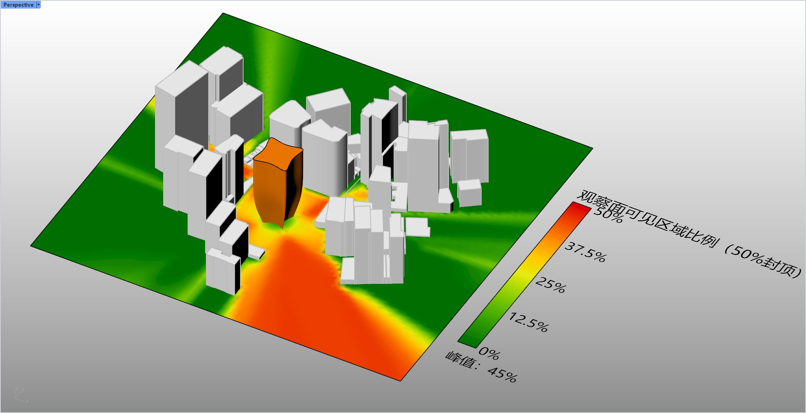
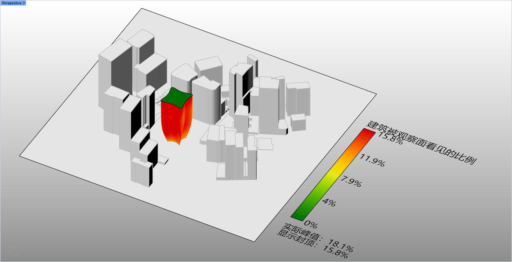

# rsVisibilityAnalysis · Visibility Analysis

> Module: Analysis / Building Performance Analysis

[← Back to command index](/en/commands/)

**Function**: Visibility Percent Vertex Shading Mesh + Legend

*Figure 1: ObserverSurface pattern. After selecting the central surface as the observation surface, the command uses ray-grid occlusion to determine the visible area ratio of the target building that can be seen from each observation point, and writes the results to the observation surface grid vertices in green-yellow-red thermal color bands; in this example, the legend 0% / 12.5% / 25% / 37.5% / 50% scale (the actual peak value of 45% is already at 50% (capped at the top), you can see a red-orange highlighted area around the central curved surface - it is the high-visibility observation point facing the open square and directly looking at the target building, while the green belt close to the side of the adjacent building is almost invisible because it is severely blocked.*

*Figure 2: Observed building pattern (TargetBuilding). After switching this mode, the command reverses to analyze which surfaces of the target building are seen by the observer: pick the mesh as the target, and its surface is recolored by the green-yellow-red thermal color band. In this example, the legend is 0% / 4% / 7.9% / 11.9% / 15.8% scale (actual peak value 18.1%, displayed as 15.8% capped), the red facade and top surface of the target building facing the square are highly visible, while the concave surface shaded by the adjacent tower turns green - making it clear at a glance which facades are worthy of being used as commercial display surfaces and which ones should be used as logistics surfaces.*

> Screenshots and videos may show a Chinese-language interface. Labels and control positions can vary by Rhino or RSTool version.

**Run**: Enter `rsVisibilityAnalysis` in the Rhino command line (opens a settings window).

**Workflow**:

1. Pop up the Eto dialog box (VisibilityAnalysisSettingsDialog)
2. Select analysis mode (observation surface/observed building)
3. Pick the observation surface mesh and the observed target mesh respectively according to the mode
4. Set maximum distance, smoothing, color matching and back filtering options
5. After confirmation, calculate the visibility percentage and write the vertex color, with legend

**Parameters**:

| Display name | Parameter | Type | Default | Range | Description |
| --- | --- | --- | --- | --- | --- |
| analysis mode | Mode | list | ObserverSurface | ObserverSurface / TargetBuilding | Observation surface mode = analyze which observation points can see the target; observed building mode = analyze which points of the building can be seen |
| maximum distance | MaxDistance | double | 0 | 0 – 100000000 (model unit), 0 means no limit | Lines of sight beyond this distance are ignored; 0 = no limit |
| smooth result | SmoothingIterations | list | Light | NoSmooth=0 / Light=1 / Medium=3 | Visibility results smoothing intensity; default 1 |
| Result Ribbon | ColorSchemeIndex | list | 5 | SunlightColorSchemes scheme list | The default index is 5 |
| Ignore points facing away from the viewing surface | FilterObserverBackfaces | toggle | true |  | Whether to skip back points in observation plane mode |
| Only count target points facing the observation surface | FilterTargetBackfaces | toggle | true |  | In the observed building mode, whether to count only points with normals facing the observer |

**Notes**: Visibility is determined by ray-grid occlusion; a maximum distance of 0 means no limit.
