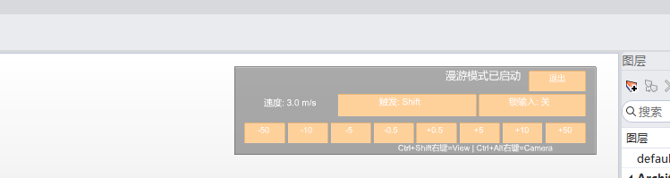

# rsWalker · Walkthrough Mode

> Module: Fun / Interactive Entertainment

[← Back to command index](/en/commands/)

**Function**: Enter FPS-style walkthrough mode and use WASD/QE to move the camera in the viewport (without modifying the geometry)

*Roaming mode: The title shows "Roaming mode has been activated" + exit button, speed/download/camera input switch on the left, -50 ~ +50 speed gear at the bottom, Ctrl+Shift=Run/E=View/Ctrl+Alt+Left button=Camera*

> Screenshots and videos may show a Chinese-language interface. Labels and control positions can vary by Rhino or RSTool version.

**Run**: Enter `rsWalker` in the Rhino command line (command-line interaction).

**Workflow**:

1. Command line input rsWalker
2. First Time: Set Speed/Framerate/Motion Trigger/Input Lock and Launch
3. After that: you can stop/adjust parameters/view status
4. Hold trigger key + WASD/QE in viewport to move camera around

**Parameters**:

| Display name | Parameter | Type | Default | Range | Description |
| --- | --- | --- | --- | --- | --- |
| speed | Speed | double | 3.0 | 0.1~1000 | Moving speed m/s |
| Frame rate | FPS | integer | 120 | 15~240 | Target refresh frame rate |
| Mobile trigger | MoveTrigger | toggle | Shift | Shift/RightMouse | Hold this key to move with WASD/QE |
| input lock | InputLock | toggle | false | off/on | Lock input to capture command related keystrokes |
