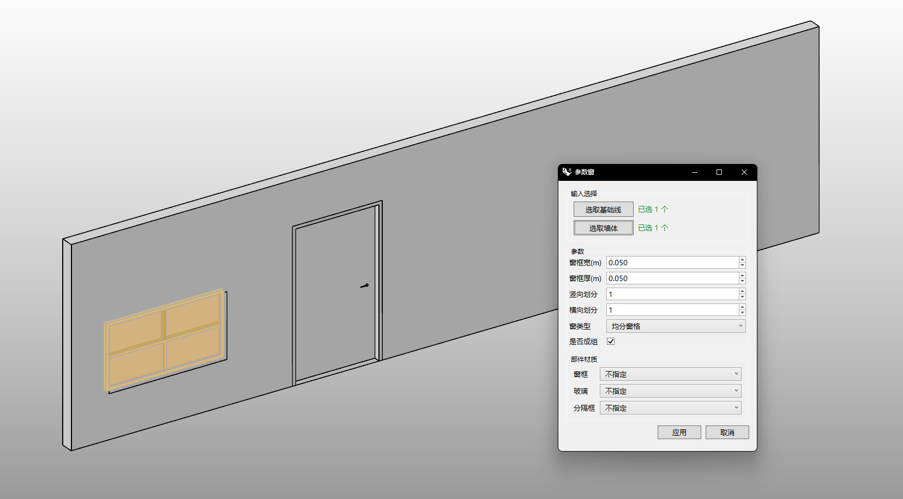

# rsWindow · Window

> Module: Architecture / Building Elements

[← Back to command index](/en/commands/)

**Function**: Make a hole in the wall and generate a window (window frame/glass/divider frame)

*Eto "Parameters" window: Select the basic line and wall body to open a hole on the wall and generate a window (including window frame/glass/separator frame). In the window, adjust the width/thickness of the window frame, vertical and horizontal divisions, window type, whether to be grouped, and the specified material of the window frame/glass/separator frame.*

> Screenshots and videos may show a Chinese-language interface. Labels and control positions can vary by Rhino or RSTool version.

**Run**: Enter `rsWindow` in the Rhino command line (opens a settings window).

**Workflow**:

1. Open parameterized form
2. Select the base line of the window opening and the host wall
3. Set window frame width/thickness, number of divisions, window type
4. Generate window (opening + window frame + glass + dividing frame)

**Parameters**:

| Display name | Parameter | Type | Default | Range | Description |
| --- | --- | --- | --- | --- | --- |
| Window frame width | FrameWidth | double | 0.05 | 0.001~10000 | Step 0.01, unit: meters |
| Window frame thickness | FrameThick | double | 0.05 | 0.001~10000 | Step 0.01, unit: meters |
| vertical division | VerticalDiv | int | 1 | 0~200 | Step 1 |
| Horizontal division | HorizontalDiv | int | 1 | 0~200 | Step 1 |
| window type | WindowType | list | 0 | Split panes equally | 0=Opening |
| in groups | IsGrouped | bool | false | true\|false | Group the generated results |
