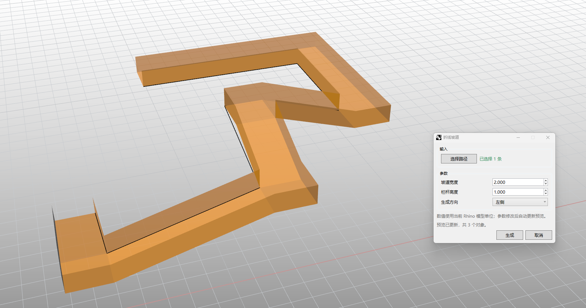

# rsZigZagRamp · Zigzag ramp

> Module: Architecture / Stairs & Ramps

[← Back to command index](/en/commands/)

**Function**: Generate polyline ramps and railings along multiple straight lines

*rsZigZagRamp pops up the "Polyline Ramp" Eto dialog box (embedded 1 path + 3 lines of parameters: ramp width / railing height / generation direction; bottom preview has been updated + generate / cancel), and the Rhino viewport generates a Z-shaped 3D ramp along the polyline path with railings automatically*

> Screenshots and videos may show a Chinese-language interface. Labels and control positions can vary by Rhino or RSTool version.

**Run**: Enter `rsZigZagRamp` in the Rhino command line (command-line interaction).

**Workflow**:

1. Select a polyline (polyline) as the ramp path
2. Set ramp width
3. Set railing height
4. Set railing style (left/right/center)
5. Generate polyline ramps and railings

**Parameters**:

| Display name | Parameter | Type | Default | Range | Description |
| --- | --- | --- | --- | --- | --- |
| ramp width | RampWidth | double | 2 | >0 (min 0.01) | Unit: meter |
| railing height | RailingHeight | double | 1.1 | >0 (min 0.01) | Unit: meter |
| style | Style | list | 0 | left\|right\|center | 0=left, 1=right, 2=center |
